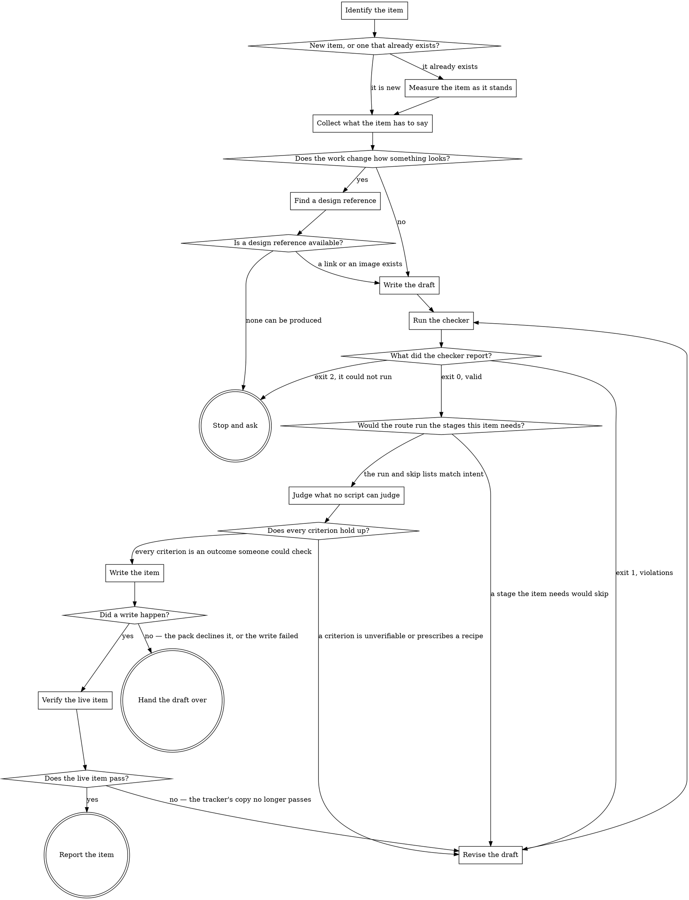

# write-specs

A work item is not documentation. It is the input to a machine: the run's first stage parses it
with fixed patterns, a readiness gate accepts or rejects it deterministically, and the conditional
stages of the route switch on booleans derived from its text. Prose written for human taste can
pass a human reviewer and still be misread by every one of those detectors — a component path
missing its trailing slash records no component at all, and five perfectly clear bullets carry no
id anything downstream can cite.

So authoring gets the same treatment as every other step: a declared shape, and a script that
proves an instance conforms.

## The checker owns the rules

`scripts/check-spec.py` is where the rules live. It reads the tracker pack's own heading tokens at
run time and *executes* the real intake extractor, the real readiness checker and the real
stage-condition evaluator against your text. Nothing in this skill restates what it enforces,
deliberately: a rule written down twice is a rule that goes stale the first time a pack changes,
and the copy that goes stale is always the one in the prose.

That leaves three kinds of rule, with three different owners:

- **What the machine detects** — the checker executes the real detectors and reports what they saw.
- **House form** — ids, section order, one assertion per criterion. The checker enforces these too.
- **Whether a criterion is worth asserting** — yours. A script can prove a criterion has an id and
  one assertion; it cannot tell you the assertion is the right one. `references/criterion-checklist.md`
  is the guide for that half, and it is never faked as a script check.

## The write goes through the tracker role, or it does not happen

A draft that passes and an item nobody pasted it into are different states that produce identical
evidence — a green checker run — because the run fetches the item and never the draft file. So the
skill finishes the job: `scripts/write-item.py` writes the item through the tracker role's
contracted operations, and the checker runs once more against the live key.

**Contracted is the operative word.** The write is a role operation the configured pack implements
and may decline, emitting the same result envelope every other operation emits. It is not a reach
for whichever tool a session happens to have connected: that write would be invisible to every
mechanism that governs the contracted ones — no role, no envelope, no way for a pack to refuse it —
and invisible is what makes a write untrustworthy, not the fact of writing.

**When the pack declines, the old behaviour is what happens.** A tracker that does not implement
the operation, or a write that fails, sends this skill back to handing the draft over. That path
is not a leftover; it is the answer for every tracker that cannot be written to, and it is taken
out loud, quoting the reason, because an item everyone believes was updated and was not is the
failure this whole flow exists to remove.

## Reference material

- `references/story-template.md` — the shape for an item that adds or changes behaviour.
- `references/bug-template.md` — the shape for an item that reports something broken.
- `references/criterion-checklist.md` — the judgement half: is this criterion worth asserting.

Read the template for the item's type when you reach **Write the draft**, not before.

## Flow



## Node Details

### Identify the item

Establish three things before writing anything:

- **Its key**, if it already exists in the tracker.
- **Its type**, spelled the way the tracker spells it. The readiness criteria are declared per type,
  so an item typed wrongly is checked against the wrong rules and passes for the wrong reason.
- **Where the draft goes.** Read `paths.spec_dir` from the project config and write to
  `<spec_dir>/<ITEM-KEY>/draft.md`. An item with no key yet gets a short slug directory instead,
  renamed once the tracker assigns one.

### New item, or one that already exists?

An existing key — go to **Measure the item as it stands**. Measuring first costs one command and is
the only way to say afterwards what the rewrite actually changed.

A new item — go to **Collect what the item has to say**.

### Measure the item as it stands

Run the checker against the live item, not against a copy of its text:

```
python3 .claude/skills/write-specs/scripts/check-spec.py <ITEM-KEY>
```

It fetches through the tracker pack's own fetch operation, so what it reports is what the run would
see. Record the violation count verbatim. That number is the before-measurement; quoting it later
from memory, or re-deriving it after the rewrite, is not evidence of anything.

Read the route half too. Whatever the current item already gets right — a design source the
detectors found, a component the route would capture — the rewrite has to keep, and losing one
silently is the easiest mistake to make here.

### Collect what the item has to say

Gather, from the requester rather than from inference:

- The outcome wanted, and why it is wanted.
- The components or files involved, written the way they appear in the repository.
- Any copy, labels or content the item supplies, which goes in verbatim.
- What is explicitly out of scope.
- What would make someone agree the work is done.

Where something is missing, ask. An item that guesses the requirement produces a run that faithfully
builds the guess, and the guess is discovered at review, after the whole route has spent its budget.

### Does the work change how something looks?

Decide honestly, because the route does not take your word for it either way. The design stages are
conditional on what the text says, and an item whose text talks about appearance while carrying no
design reference is refused at the readiness gate — terminal, before any work starts.

Do not try to predict which words trip that detector. The keyword list lives in the tracker pack and
the checker reports exactly which words matched; guessing at it here would be a second, staler copy.
Answer the plain question instead: will someone look at the result and compare it to a design?

Yes — go to **Find a design reference**. No — go to **Write the draft**.

### Find a design reference

Either a link to the specific design node, or an image attached to the item. Prefer the link: it
pins a frame, survives being reopened, and carries values an image cannot.

One limitation worth knowing before it surprises you: a draft has no attachments, so while the
checker is reading a draft file the only design source it can possibly see is a link in the text. If
the real item will carry an image instead, the draft will look design-less to the checker. That
resolves itself at **Verify the live item**, which reads the item and can see an attachment — but
only once the image is actually on it, so attach it as part of writing the item rather than
leaving it for later.

### Is a design reference available?

A link or an image can be produced — go to **Write the draft**.

Nothing can be produced, and the work still changes how something looks — go to **Stop and ask**.
Writing the item anyway does not get the work started sooner; it gets it refused at the gate, having
spent a run to say what you already know.

### Write the draft

Read the template for this item's type — `references/story-template.md` or
`references/bug-template.md` — and write the draft at the path chosen in **Identify the item**.

The front matter carries the fields the tracker holds outside the description: the item's type and
summary always, plus its key, labels and components where those are known. The body below it is the
description exactly as it will appear in the tracker, headings and all.

Two habits that matter more than they look:

- **Paste supplied content, do not paraphrase it.** Copy the requester wrote is the requirement, not
  a description of it.
- **Write every path exactly as the repository spells it**, trailing separator included. The
  extractor matches paths literally, and a path it does not match is a component the run never
  knows about.

### Run the checker

```
python3 .claude/skills/write-specs/scripts/check-spec.py <spec_dir>/<ITEM-KEY>/draft.md
```

Read the whole report, not just the exit code. It has two halves and only one of them is about
pass or fail:

- **route** — a dry run. It executes the real extractor, readiness checker and condition evaluator
  and prints the fact record the run would compute, the tokens that matched, the readiness verdict
  and which stages would run or skip. Most of this is true and worth knowing even when the exit code
  is 0.
- **form** — the house rules, one `ok:` line per rule that held.

### What did the checker report?

- **Exit 1** — at least one violation. Every `invalid:` line names one specific thing to change. Go
  to **Revise the draft**.
- **Exit 2** — the checker could not run to a verdict at all: a config, pack or script it needs is
  missing or unreadable. This is a fault in the environment, not in the draft, and editing the draft
  cannot fix it. Go to **Stop and ask**. Treating "did not run" as "passed" is how a check becomes
  decorative.
- **Exit 0** — every rule held. Go to **Would the route run the stages this item needs?**

Lines beginning `review:` are notes, not failures. They mark the places where the script suspects
two assertions wearing one id but cannot prove it. Judge each one; leaving one unread is how a
compound criterion survives.

### Revise the draft

Change the draft, and re-run. Nothing else.

If a rule looks wrong, that is a conversation about the checker — worth having, in its own change,
with its own test case. It is never a reason to route around the check for this one item, because
the item is not the thing being protected; the next hundred items are.

The single exception is exit 2, which is not a draft problem and is handled at **Stop and ask**.

### Would the route run the stages this item needs?

The route half printed which stages would run and which would skip. Read the skip list and, for each
entry, ask whether this item genuinely does not need that stage.

A stage that skips because a field is empty is fixed by filling that field — in the draft's front
matter and on the real item — not by rewording the description. The trap is that some conditions
read the tracker's own structured fields rather than the description text, so an item can name a
component in three sentences of prose and still skip the stage that would have captured that
component's current state.

Something in the list contradicts what the item needs — go to **Revise the draft**. The lists match
intent — go to **Judge what no script can judge**.

### Judge what no script can judge

Read `references/criterion-checklist.md` and walk the criteria against it.

This is the half that was deliberately left to a reader. The checker has already proved each
criterion has an id, stands alone and states something; it has no opinion about whether the thing
stated is the thing that matters, whether the set is complete, or whether a criterion describes the
outcome or quietly dictates the implementation.

### Does every criterion hold up?

A criterion fails the checklist — go to **Revise the draft**, and say in your revision note which
checklist question it failed, so the same criterion does not come back reworded.

Every criterion is an outcome someone could check, and together they mean the item is done — go to
**Write the item**.

### Write the item

```
python3 .claude/skills/write-specs/scripts/write-item.py <spec_dir>/<ITEM-KEY>/draft.md [--project <key>]
```

Pass `--project` when the item does not exist yet. The script decides create versus update by
asking the tracker whether the key exists, not by trusting the draft: a key in front matter is
what someone expects, and acting on that expectation is how an update gets aimed at a key nobody
issued, or a second copy of an existing item gets made.

Everything else it does is resolution — which pack is configured, which skill implements the
operation, whether the pack declines it. None of that is a judgement, so none of it is left to be
judged here.

### Did a write happen?

- **Exit 0 and `verdict: pass`** — go to **Verify the live item**.
- **Exit 1** — the configured tracker declines the operation or declares none. The draft is
  unwritten and the envelope says which. Go to **Hand the draft over**.
- **Exit 0 and `verdict: fail`** — the operation ran and the tracker refused it: a field it does
  not carry, a type it does not offer, credentials it did not accept. The envelope's `summary`
  names the reason. Go to **Hand the draft over**, and quote it.
- **Exit 2** — a config, pack or script that cannot be read. Go to **Stop and ask**.

### Verify the live item

```
python3 .claude/skills/write-specs/scripts/check-spec.py <ITEM-KEY>
```

Against the key, not the file. The tracker converts the description into its own storage format on
the way in, and what comes back out is not guaranteed to be what went in. The draft passing proves
the draft; only this run proves the thing a route will actually fetch.

### Does the live item pass?

**Exit 0** — go to **Report the item**.

**Exit 1** — the tracker's copy no longer passes. Go to **Revise the draft**, fix it there, and
come back through the write, which is now an update. Editing the item in the tracker's own UI
instead leaves the draft and the item disagreeing, and the draft is what the next rewrite starts
from.

### Report the item

Produce, in the response:

1. **The key and the URL**, so the item can be opened without searching for it.
2. **Which write happened** — created, or description replaced. An update overwrites text someone
   may have edited in the tracker; the operation saves the previous description and names that
   file, so say it was replaced rather than leaving it to be discovered.
3. **The draft's path**, so the text can be re-checked without being reconstructed.
4. **The verdict from Verify the live item**, quoted from that run. For a rewrite, the before
   count from **Measure the item as it stands** beside it, also quoted.
5. **What still has to be done on the item itself** — an image to attach, a field the tracker
   would not take, a decision left open.

The description does not need repeating when it is already in the item; a link cannot drift from
it. Then stop — writing the description is the authoring step, and deciding the item's status is
somebody else's call.

### Hand the draft over

This is where a tracker that cannot be written to ends up, which is most of them until a pack
implements the operations. Produce, in the response:

1. **Why the write did not happen**, first and in one line, quoting the envelope's own `summary`.
   Putting it last, after a wall of text that looks like success, is how someone comes away
   believing the item was updated.
2. **The summary**, on its own line, ready to paste into the tracker's own summary field.
3. **The description**, verbatim, as one block.
4. **The draft's path**, so the text can be re-checked without being reconstructed.
5. **The numbers**, for a rewrite: the before count from **Measure the item as it stands** and the
   after count from the final checker run, both quoted from the runs rather than remembered.
6. **What still has to be done on the item itself** — attaching an image, setting the type, filling
   a structured field a condition reads. These are the parts a description cannot carry, and they
   are exactly the parts that get forgotten once the prose looks finished.

Then stop. Do not post, edit or transition the item.

### Stop and ask

Name which of the two cases this is — a visual change with no obtainable design reference, or a
checker that could not run — and name precisely what you need to continue.

Do not substitute a draft that will be refused, and do not present an unchecked draft as if it had
passed. An honest stop is a complete answer; a draft nobody verified is a liability that reads like
progress.
