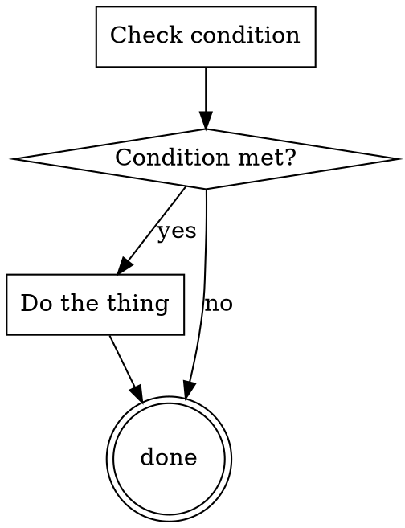

# Example — missing heading

## Flow

```dot
digraph example {
    "Check condition" [shape=box];
    "Condition met?" [shape=diamond];
    "Do the thing" [shape=box];
    "done" [shape=doublecircle];

    "Check condition" -> "Condition met?";
    "Condition met?" -> "Do the thing" [label="yes"];
    "Condition met?" -> "done" [label="no"];
    "Do the thing" -> "done";
}
```

## Node Details

### Check condition

Check it.

### Condition met?

Branch on the result.

### done

Report done.
