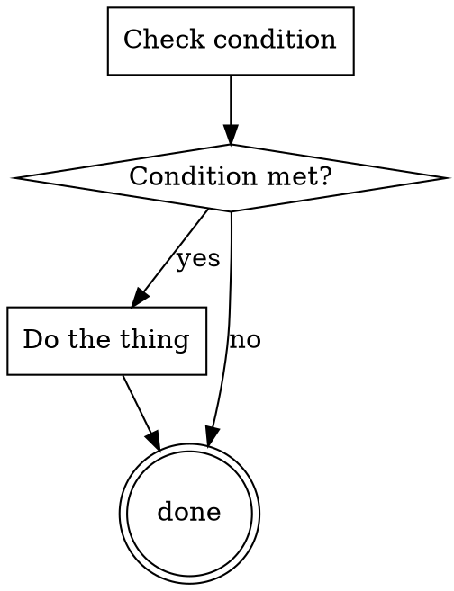

# Example — orphan heading

## Flow

## Node Details

### Check condition

Check it.

### Condition met?

Branch on the result.

### Do the thing

Do it, then go to **done**.

### done

Report done.

### Never reached

A step the digraph above never routes to — this heading has no matching node.
