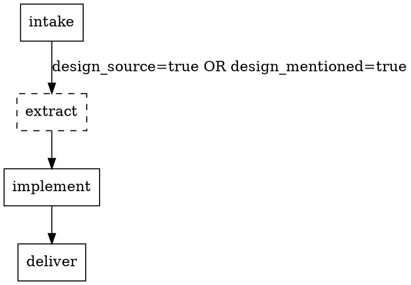

# Pack manifest

A pack declares itself with `pack.yaml` at its own root, alongside its `skills/` directory. There
are two kinds, each with its own fixed shape.

## Location

`pack.yaml` at the root of the pack. Skills it names resolve to
`<pack root>/skills/<skill name>/SKILL.md`. A platform pack also ships `route.dot` at that same root.

## Format — platform pack

```yaml
kind: platform
stages:
  - id: <stage id>              # one of the fifteen below
    skill: <skill name>
    when:                       # optional; omit entirely for an always-on stage
      - { <fact field>: <value>, … }
      - { <fact field>: <value>, … }
    fix_attempts: <int>         # optional
always_autonomous: [<stage id>, …]
readiness_criteria:
  <item_type>:
    require: [<fact field>, …]
artifacts:
  - id: <artifact id>
    produced_by: <stage id>
    path: "<relative path>"
onboarding_state_path: "<relative path>"   # optional
audit_findings_path: "<relative path>"     # optional
audit_digest_path: "<relative path>"       # optional
```

## Format — provider pack

```yaml
kind: provider
role: tracker | scm | design | browser
operations:
  <operation name>: <skill name>
  …
unsupported: [<operation name>, …]
scripts:                        # optional
  <operation name>: "<path, relative to the pack root>"
text_conventions:               # tracker role only
  design_keywords: [<string>, …]
  reproduction_headings: [<string>, …]
  acceptance_criteria_headings: [<string>, …]
requires:                       # optional
  - tool: <identifier>
    probe: [<argv>, …]
    remedy: "<what a human runs to fix it>"
```

## Top-level keys

Fixed per kind, in order.

- **platform** — `kind`, `stages`, `always_autonomous`, `readiness_criteria`, `artifacts`. All
  required; `always_autonomous` and `artifacts` may be empty (`[]`) but must be present, the same way
  an empty `artifacts` list is present on every result envelope rather than omitted.
  `onboarding_state_path`, `audit_findings_path` (D80) and `audit_digest_path` (G500) are the
  exceptions to "all required" — all three optional, and a pack may declare any subset of them,
  including none.
- **provider** — `kind`, `role`, `operations`, `unsupported`, `scripts`, and `text_conventions` for
  the `tracker` role. The first four are required; `unsupported` may be empty (`[]`) but must be
  present. `scripts` and `text_conventions` are both optional.

## The stage vocabulary

**Fifteen ids, fixed. The core defines every one.** A pack implements an id or declines it; no pack
may add one, and adding one is a version bump on this contract. In the order a full route runs them:

`intake`, `readiness`, `extract`, `conventions`, `serve`, `baseline`, `prototype`, `verify-design`,
`plan`, `plan-gate`, `implement`, `verify`, `lint`, `publish-gate`, `deliver`.

A pack that needs behaviour no id covers implements it inside a stage it already owns. There is no
open class.

## Field rules — platform

- `stages` — an ordered **list**, one entry per stage, each with an `id` from the fifteen and a
  `skill`. Order is execution order. A stage id appears at most once.
- The list **begins with `intake` and ends with `deliver`**, and neither carries a `when:`. A route
  that skipped `intake` would have no fact record to filter itself with, and one that skipped
  `deliver` could never reach a delivered terminal state.
- `when` — optional per stage. Omit it entirely for a stage that always runs; the key present but
  empty is a contract violation, not an always-on stage. Semantics below.
- `fix_attempts` — optional per stage, a positive integer overriding the configured default. It
  counts **edits**, not checks: `N` allows up to N edits and N+1 checks (`fix-loop.md`). The
  component that drives a route never applies it: every retry loop is internal to the stage that
  owns it, and asks `check-fix-budget.sh` rather than counting.
- `always_autonomous` — every entry must be a stage id present in `stages`. A `question` from such a
  stage is treated as a failure in both execution modes.
- `readiness_criteria` — keyed by `item_type`, each with a `require` list of fact-record fields.
  **At least one `item_type` must be declared**, and every field required must be a real fact-record
  field (`fact-record.md`). A pack declaring none would fail every item it was given; a criterion
  naming a field the record does not carry could never be satisfied.
- `artifacts` — every entry's `produced_by` must be a stage id present in `stages`. `id` names the
  artifact; `path` is the relative path it is written to.
- `onboarding_state_path`, `audit_findings_path` (D80), `audit_digest_path` (G500) — all three
  optional. When present, each must be a
  non-empty, quoted, relative path: no leading `/`, and no `..` path segment. This validator checks
  only that the string is a well-formed relative path — never that it exists in any project's
  working tree, since a pack has no fixed project to check against. A declared path is read at
  runtime by pre-flight's third check (`pre-flight.md`), never by anything in this validator.
- `audit_digest_path` (G500) — the file the platform pack's own audit writes recording what each
  file it judged hashed to when it judged it: one `<sha256>  <relative path>` line per file. The
  core never learns what any listed path is for; it re-hashes the paths the digest itself names,
  which is how a freshness check stays platform-neutral (D28). Declared here, read only at runtime.
- Every skill named in `stages` must resolve to `<pack root>/skills/<skill name>/SKILL.md`. A skill
  name with no matching directory is a **dangling skill reference**.
- Every skill named in `stages` must declare isolated execution in its own frontmatter — the literal
  key is `context: fork`. Every stage runs as an isolated subagent; a skill that omits the
  declaration still resolves and still returns a valid envelope, so nothing about a run visibly
  fails — what fails silently is the cost model, because that stage's context then accumulates in
  whichever component drives the route instead of dying with the stage. This applies only to a
  platform pack's stage skills, never to a provider pack's operation skills.

## Condition semantics

- **A stage with no `when:` always runs.**
- **`when:` is a list of blocks. Any block matching runs the stage** — blocks are alternatives.
- **Within one block every key must match.** Absent keys are not tested.
- **Keys name fact-record fields only** (`fact-record.md`). Nothing else is addressable: not the
  environment, not a previous stage's output, not the clock. Environment questions — is a tool
  installed, is an operation supported — are answered once before the first stage, never inside a
  condition, because a condition that could probe a machine would make a run's shape depend on the
  machine it ran on.
- **A value must match its field's kind**, which is what lets a condition be checked before a run
  rather than discovered during one:
  - a **list** field — `labels`, `components`, `files_named` — compares against `present` or
    `empty`, and nothing else. An absent list and an empty one are the same thing to a reader of
    the fact record, so both are `empty`.
  - a **boolean** field — `design_source`, `design_mentioned`, every `has_*` — compares against
    `true` or `false`.
  - a **string** field compares against a literal, for equality.

  A field the record does not carry, or carries as `null`, matches nothing except a list's `empty`:
  it was never determined, and guessing is exactly what the fact record forbids.
- **A skipped stage is recorded `skipped`**, along with the condition that skipped it, and control
  passes to the next stage in list order. Skipping is visible, which a list that simply never
  contained the stage was not.

The list form exists because a single all-keys-must-match block cannot express a stage that must run
when a reference is present *or* when the text asked for one:

```yaml
- id: extract
  skill: extract
  when:
    - { design_source: true }
    - { design_mentioned: true }
```

A stage gated on a list field names the kind of test it wants rather than a value:

```yaml
- id: baseline
  skill: baseline
  when:
    - { components: present }
```

**Conditions are evaluated once**, against the fact record, as soon as that record exists. The record
is written once and never rewritten, so a stage's skip state cannot change mid-run.

### Canonical rendering

One `when:` has exactly one string form, so that comparing a condition is string equality rather
than judgment. Blocks joined by ` OR ` in list order; keys within a block joined by ` AND ` in
fact-record field order; each key rendered `<field>=<value>`, unquoted, single-spaced. The example
above renders:

```
design_source=true OR design_mentioned=true
```

This is the form recorded against a skipped stage, and the form the route digraph's edge labels carry.

## The route digraph

A platform pack ships **`route.dot` at its root**: the stage list drawn as a graph, checked against
the manifest so the picture cannot drift from the contract.



- **Nodes are stage ids and nothing else.** Every node name is exactly an id from `stages`, and every
  id has a node — a bijection. No decoration, no gate suffix, and no pre-flight, decision or terminal
  nodes: admitting those would require a marker to exclude them, and a bijection needs none.
- **A conditional stage's node is `style=dashed`**; an always-on stage's node is not. Both directions
  are checked.
- **A conditional stage's incoming edge carries `label="<canonical rendering of its `when:`>"`**,
  compared by string equality. A label differing by one character is a failure, and the failure names
  both strings.
- **Edges follow list order, and there are no bypass edges.** This is a filtered list, not a
  branching graph: a skipped stage hands control to the next stage in order, which needs no edge of
  its own.

## Anti-patterns

- `stages` written as a mapping of id to skill rather than an ordered list.
- A stage id outside the fifteen, or one appearing twice.
- `intake` or `deliver` carrying a `when:`, or the list beginning or ending with anything else.
- A `when:` key naming anything but a fact-record field — it can never match, and would silently
  disable its stage forever.
- A `when:` present but empty. Omit the key instead.
- A condition testing the environment, the clock, or a previous stage's output.
- `readiness_criteria` absent, empty, or requiring a field the fact record does not carry.
- `always_autonomous` or an artifact's `produced_by` naming a stage id absent from `stages`.
- A stage announcing its own skip from inside its result envelope. A condition is declared by the
  pack and evaluated from the fact record; `next_action` is a name, not a directive.
- `route.dot` absent, carrying a node that is not a stage id, missing a node for a declared stage,
  marking an always-on stage dashed (or leaving a conditional one undashed), or carrying an edge
  label that does not match its stage's `when:` exactly.
- `operations` or `unsupported` naming an operation outside the declared role's set; an operation in
  both; a role operation in neither.
- A skill name with no `<pack root>/skills/<skill name>/SKILL.md` on disk.
- `scripts` naming an operation absent from `operations`, or a path that does not resolve to a real
  file under the pack root.
- `scripts` present but empty. Omit the key instead.
- A stage skill's frontmatter omitting `context: fork`.
- A top-level key outside the fixed set for the manifest's `kind`, or a required key missing.
- `onboarding_state_path`, `audit_findings_path` or `audit_digest_path` present but empty, absolute
  (a leading `/`), or containing a `..` path segment.
- Any file under the pack root containing the literal sequence `{{`, the reserved marker for an
  unfilled template placeholder. A generated pack that still carries one is a failed setup, not a
  pack with a hole in it.

## Field rules — provider

- `role` — exactly one of the four core roles. Each has a fixed set of operation names it must
  account for:
  - `tracker` — `fetch_item`, `post_note`, `attach_file`, `list_types`
  - `scm` — `create_branch`, `publish_change`, `check_status`
  - `design` — `fetch_reference`
  - `browser` — `render`, `capture`, `measure`, `interact`
- `operations` — a mapping of operation name to skill name. Every key must be an operation that role
  actually has.
- `unsupported` — operation names this pack declines to implement. Every entry must be an operation
  that role has, and must not also be a key of `operations`.
- **Completeness.** Every operation the declared role has must appear in one of the two. One in
  neither is silently missing — the runner would only discover it mid-run.
- `scripts` — optional. A mapping of operation name to a path, relative to the pack root, of a
  directly-executable script implementing that same operation for a caller that must run it as a
  subprocess rather than through `Skill()` — most operations are only ever invoked the latter way, so
  a provider with no such caller declares nothing here. Every key must also be a key of `operations`
  (naming a script for an operation this pack does not implement is meaningless), and every path must
  resolve to a real file under the pack root, the same way an `operations:` skill name must resolve.
  A caller that needs an operation's script form and finds `scripts` silent about it degrades rather
  than guessing one — this is never inferred from a skill's own prose.
- `text_conventions` — `tracker` role only. Describes how one tracker's items are written: the word
  list that sets `design_mentioned` (`design_keywords`) and the heading names that set
  `has_reproduction_steps` (`reproduction_headings`) and `has_acceptance_criteria`
  (`acceptance_criteria_headings`). It lives with the tracker because a team that formats items
  differently changes its tracker pack, not its platform pack. `has_reproduction_url` needs no list
  here — any `http(s)` URL in the sanitized text sets it.
- `requires` — optional. What this pack needs present on the machine that runs it: a tool, a
  downloaded binary, anything selecting the pack does not by itself provide. Each entry declares
  three things.
  - `tool` — a non-empty identifier for what must be present. It names the thing, and it is what a
    report says is missing.
  - `probe` — how "present" is answered, as a **list of arguments, never a string**. An argument may
    carry the literal prefix `<pack>/`, which resolves against the pack root — the way a pack whose
    "is it present" question needs real logic (a fallback search path, a second artifact the first
    one says nothing about) ships that logic as its own script instead of asking the core to guess
    on its behalf. The prefix is required for that: a bare relative path would resolve against
    whatever directory the caller happened to run from. Such a path is checked exactly as a
    `scripts:` path is — no `..` segment, and the file must exist — because a probe pointing at a
    file that is not there is a check that will never run, and a check that never runs must not look
    like one that passed. A string would
    have to reach a shell to be run, and a shell is the one thing a precondition check must not
    need. Only the exit status is read: zero means present. The output is never parsed and a version
    is never compared — a version requirement is a second question this key deliberately cannot ask,
    because answering it would mean parsing whatever the tool happened to print.
  - `remedy` — what a human runs to fix it. It is quoted text, printed verbatim by whatever reports
    the tool missing, and **nothing ever executes it**. A pack that could install its own dependency
    would be a pack that changes the machine it was merely asked to run on.
  - **Absent means ungated**, the same rule an undeclared `unsupported:` list already follows. A
    pack that declares no `requires` has no local precondition; silence is never read as a hidden
    one.
  - **Declaring this gates nothing at load time.** Two readers consult it — a read-only diagnostic,
    on demand, and the operation itself before it acts — and both quote the declared `remedy` rather
    than composing their own. The capability check that runs before a route starts reads manifests
    only and never probes a machine, so a missing tool is reported, never guessed at, and never
    discovered by a route that already created a branch.
- Every skill named in `operations` must resolve to `<pack root>/skills/<skill name>/SKILL.md`.

## Example — platform

```yaml
kind: platform
stages:
  - id: intake
    skill: intake
  - id: extract
    skill: extract
    when:
      - { design_source: true }
      - { design_mentioned: true }
  - id: implement
    skill: implement
    fix_attempts: 3
  - id: deliver
    skill: deliver
always_autonomous: [deliver]
readiness_criteria:
  task:
    require: [has_description, has_acceptance_criteria]
artifacts:
  - id: fact-record
    produced_by: intake
    path: ".ai/run-context/fact-record.yaml"
```

## Example — provider

```yaml
kind: provider
role: tracker
operations:
  fetch_item: fetch
  post_note: note
  attach_file: attach
  list_types: list
unsupported: []
```

A `browser`-role provider that also has a script-level caller declares `scripts` for the operation
that caller needs:

```yaml
kind: provider
role: browser
operations:
  render: render
  capture: capture
  measure: measure
  interact: interact
unsupported: []
scripts:
  render: "skills/render/scripts/render.cjs"
```

## Reference, not restatement

A skill or script that reads a pack manifest references this file with one line rather than
restating the shape inline, the same convention `project-config.md` and `result-envelope.md` use
for their own contracts.

## Fixtures

`fixtures/pack-manifest/platform-valid/` (always-on stages only) and
`fixtures/pack-manifest/platform-valid-conditions/` (the same pack with a conditional stage, its
`route.dot` carrying the dashed node and the matching edge label) are well-formed platform examples;
`fixtures/pack-manifest/provider-valid/` is the provider one. Each is a small pack root with a
matching `skills/` directory.

`fixtures/pack-manifest/platform-valid-onboarding/` is `platform-valid` with all three of
`onboarding_state_path`, `audit_findings_path` and `audit_digest_path` declared — proof the optional
keys coexist with an otherwise-conformant manifest, and in that order.

`fixtures/pack-manifest/platform-invalid/` holds one directory per rejection case:
`unknown-stage-always-autonomous`, `unknown-stage-artifact-producer`, `dangling-skill`,
`stage-not-isolated`, `unfilled-placeholder`, `stage-id-not-in-vocabulary`, `when-unknown-field`,
`no-readiness-criteria`, `readiness-criteria-unknown-field`, `digraph-node-not-a-stage`,
`digraph-missing-node`, `digraph-label-mismatch`, `onboarding-path-absolute`,
`onboarding-path-traversal` and `onboarding-path-empty`. `fixtures/pack-manifest/provider-invalid/`
holds `missing-operation`, `unknown-operation` and `dangling-skill`. `scripts`'s own rejection cases
(unknown operation, dangling script, present-but-empty) are inline in the validator's test suite,
alongside the remaining shape errors that fit a single block.

## Verification

`lib/validate-pack-manifest.sh <path-to-pack.yaml>` is the deterministic checker — no model
involved. It exits `0` and prints `valid: <kind>` for a conformant manifest, `1` with
`invalid: <reason>` on stderr for a contract violation, `2` for a usage error.

`lib/evaluate-stage-conditions.sh <path-to-pack.yaml> <path-to-fact-record.yaml>` evaluates every
stage's `when:` against a fact record and prints, in list order, one `run: <stage id>` or
`skipped: <stage id> — <canonical rendering>` line per stage. Also deterministic, also no model.

```bash
bash plugins/agentic-core/shared/lib/validate-pack-manifest.test.sh
bash plugins/agentic-core/shared/lib/evaluate-stage-conditions.test.sh
```
