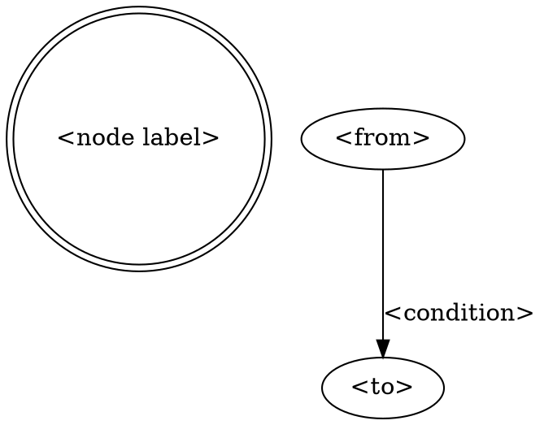

# Skill authoring

**A skill that branches is written as a DOT digraph, not prose numbered steps.** A skill with no
branching — one path, start to end, nothing conditional — keeps numbered steps; forcing a digraph
on a linear skill adds a diagram nobody needed to read. What decides which a given skill is: does
any point in its control flow have more than one outgoing path? If yes, it branches.

## The digraph

A `## Flow` section, after any sections a skill needs to explain its own reference material, holds
one fenced ` ```dot ` block:



Every node label is a double-quoted string, verbatim — it is also the heading text used in
`## Node Details` below, so punctuation, capitalization and wording must match exactly. An edge out
of a `box` node needs no label (there is exactly one path forward); an edge out of a `diamond`
needs one, naming the condition that takes it.

## Node Details

A `## Node Details` section follows `## Flow`, with one `### <node label>` heading per digraph
node. Each heading's body is the instruction for that node — what to do, or what decides where to
go next — replacing what a numbered step would have said. **Correspondence is checked in both
directions:** every digraph node needs a matching heading, and every heading needs a matching
digraph node. A heading with no node is dead documentation for a step the flow no longer takes; a
node with no heading is a step nobody wrote instructions for.

## Other rules

- Helper scripts a skill ships live at `skills/<name>/scripts/*.sh` and must be executable
  (`chmod +x`) — a script the harness cannot execute fails silently, as a "command not found," not
  as a usage error.
- No project-specific value in a SKILL.md — no URL, project key, or branch name. A skill is shared
  across every project that loads the pack it ships in; a value only one project has belongs in
  that project's own config, never in the skill that reads it.

## Anti-patterns

- Prose numbered steps for a skill whose control flow actually branches — resume-or-fresh, a
  per-stage decision with more than one outcome, more than one terminal state. This is the shape
  the digraph requirement exists to catch, precisely because numbered steps can express a branch in
  prose without ever admitting how many ends the flow actually has.
- A `### heading` under `## Node Details` with no matching digraph node, or a digraph node with no
  heading.
- Restating a node's instruction elsewhere in the file instead of in its own `## Node Details`
  entry — the node text is the single source for what that step does.
- A digraph edge out of a `diamond` node with no `label`, or a label on an edge out of a `box` — the
  label is where a branch's condition lives; a decision without one is unreadable, and a label on a
  node with only one way forward means something outside the diagram is deciding.

## Fixtures

`fixtures/skill-authoring/clean/` — a small branching skill whose digraph nodes and `### heading`s
match. `fixtures/skill-authoring/clean-linear/` — no `## Flow`/`## Node Details` at all, accepted
trivially. `fixtures/skill-authoring/violation-missing-heading/` — a digraph node with no matching
heading, must fail. `fixtures/skill-authoring/violation-orphan-heading/` — a heading with no
matching digraph node, must fail.

## Verification

`lib/validate-contracts.sh <path-to-SKILL.md-or-directory>` is the deterministic checker — no model
involved. Given a single file, it checks exactly that file; given a directory, it checks every
`SKILL.md` found under it. It extracts every quoted node label from a file's `## Flow` digraph and
every `### heading` under its `## Node Details`, and exits `0` with `valid: skill-authoring (<n>
SKILL.md files scanned, <b> branching)` when every file checked has full correspondence — including
a file with neither section, which passes trivially. It exits `1` with one `invalid: '<label>' —
<path>: <reason>` line per mismatch on stderr, in both directions, then a count; `2` for a usage
error (missing argument, or the given path does not exist).

```bash
bash plugins/agentic-core/shared/lib/validate-contracts.test.sh
```
