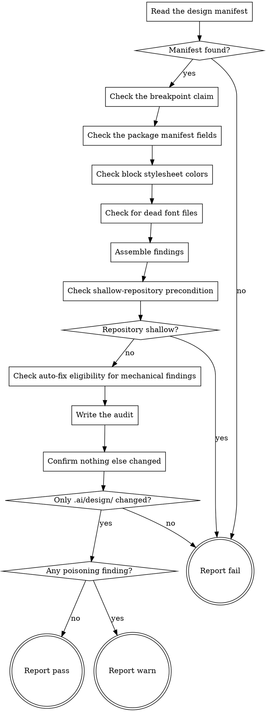

# eds-audit-design-system

Manual invocation, run any time after `eds-adopt-design-system` has written a design manifest —
this is not a route stage and no pack-manifest condition ever schedules it. A human, or
`eds-adopt-design-system` itself as its own second step, runs it deliberately when there is an
adopted token set to audit the project against.

Read `../../../agentic-core/shared/audit-taxonomy.md` for the four classes, the severity test, and
the required shape of a finding this skill writes every one of its findings against, and
`../../../agentic-core/shared/design-manifest.md` for the manifest shape this skill reads.
`../../../agentic-core/shared/result-envelope.md` is the `## Result` block every path through this
flow ends with.

**What this platform pack knows, that the core does not:** the design manifest lives at
`.ai/design/design-system.md`; the house-style document carrying this project's breakpoint claim
is `AGENTS.project.md`; the stylesheets that actually enforce a breakpoint are `styles/styles.css`
and every `blocks/*/*.css`; the package manifest is `package.json`; block-level color rules live in
`blocks/*/*.css`; this platform's fonts are declared via `@font-face` in `styles/fonts.css` and
served from `fonts/`; and the paths an agent reads as truth are listed in this skill's own
`trusted-context-files.txt`, read by every `classify-severity.sh` call below. None of this is core
vocabulary — a different platform pack would name entirely different paths.

## Input

None. Audits the project at the current working directory; nothing is passed in.

## Flow

## Node Details

### Read the design manifest

Read `.ai/design/design-system.md` at the project root — the manifest `eds-adopt-design-system`
writes (`../../../agentic-core/shared/design-manifest.md`). This skill only reads it; nothing in
this flow ever writes to it.

### Manifest found?

The file exists — continue to **Check the breakpoint claim**. It does not — go to **Report
fail**: nothing has been onboarded yet, so there is no adopted token set to audit anything
against.

### Check the breakpoint claim

1. From `AGENTS.project.md`, collect every value `N` appearing in a quoted
   `` `@media (width >= Npx)` `` literal — the set of breakpoints the document itself claims.
2. From `styles/styles.css` and every `blocks/*/*.css` file, collect every value `N` appearing in
   an actual `@media (width >= Npx)` rule — the set of breakpoints the code actually enforces.
3. The two sets are equal — no finding. They differ — one finding:
   - `class: mechanical` — the codebase's own actual set is the one, derivable answer; nothing
     about applying it needs a human.
   - `file`: `"AGENTS.project.md"`.
   - `finding`: one sentence naming the claimed set and the actual set.
   - `diff`: the exact line(s) in `AGENTS.project.md` that name the claimed set, with every
     claimed value replaced by the corresponding actual value (when both sets have the same
     number of entries) or, when they do not, the claimed list replaced outright by the actual
     set written out in the same prose shape.
   - `severity`: run `../../../agentic-core/shared/lib/classify-severity.sh AGENTS.project.md
     trusted-context-files.txt` (paths relative to this skill's own directory for the second
     argument). `AGENTS.project.md` is on this pack's own trusted-context list, so this finding is
     always `poisoning` when it exists at all — every stage that reads this document inherits
     whichever value it states.

### Check the package manifest fields

1. Read `package.json`'s `name`, `description` and `repository.url`.
2. **`repository.url`** — run `git remote get-url origin` and transform it into the same
   `git+https://github.com/<owner>/<repo>.git` shape `package.json`'s own field uses. If the
   two differ, record one finding: `class: mechanical` (the actual git remote is the one,
   derivable answer), `file: "package.json"`, `diff` replacing the stale URL with the derived
   one, `severity` from `classify-severity.sh package.json trusted-context-files.txt` (a package
   manifest is not on this pack's trusted-context list, so this is always `cosmetic`).
3. **`name`** and **`description`** — this platform's own upstream template ships fixed default
   values for both (`@adobe/aem-boilerplate` and `Starter project for Adobe Helix`). Nothing else
   in the project states what this project should actually be called or described as, so a field
   still holding its template default is evidence nobody has answered the question yet, not
   evidence the default is correct. For each field still holding its default, record one finding:
   `class: needs-the-human`, `file: "package.json"`, `question` naming the field
   (`"what should package.json's <field> say?"`), `diff` replacing the default value with a
   placeholder naming that question, `severity` from `classify-severity.sh` (always `cosmetic`,
   same reasoning as `repository.url`). A field that no longer holds its default is already
   answered — no finding for it.

### Check block stylesheet colors

1. Search every `blocks/*/*.css` file for a raw hex color literal (`#` followed by 3, 4, 6 or 8
   hex digits).
2. For each one found, run `../../../agentic-core/shared/lib/classify-hex-token.sh <hex>
   .ai/design/design-system.md`:
   - `mechanical: exact match — <token> (<value>)` — one finding, `class: mechanical`, `diff`
     replacing the literal with `var(--<slug>)`, using the same name-to-slug rule
     `write-design-manifest.sh` uses for that token (lowercase, non-alphanumerics to `-`).
   - `judgment: close match — <token> (<value>), max channel difference <n>` — one finding,
     `class: judgment`, `recommendation` and `default` both naming the same replacement.
   - `no-match` — no finding. An unrelated color is not evidence of anything; a stylesheet may
     legitimately use colors the adopted token set never named.
3. Every finding from this node names the block's own `.css` file in `file`, and its `severity`
   comes from `classify-severity.sh <that file> trusted-context-files.txt` — a block stylesheet is
   never on this pack's trusted-context list, so always `cosmetic`. No agent reads a stylesheet's
   own color values as a claim about anything; it reads them as the values themselves.

### Check for dead font files

1. Parse every `@font-face` rule in `styles/fonts.css`, recording each rule's `font-family` name
   and the file its `src` points at.
2. For each distinct family name, run `../../../agentic-core/shared/lib/check-reference.sh
   <family> styles/ styles/fonts.css` — is that family used in a `font-family` declaration
   anywhere outside the file that declares it.
3. Exit `1` (`not-referenced`) — one finding per font file that family registers: `class:
   mechanical` (deleting an unreferenced file has one derivable answer), `file`: the font file's
   own path, `diff` removing that file and its own `@font-face` rule, `severity` from
   `classify-severity.sh <the font file> trusted-context-files.txt` — always `cosmetic`: no agent
   reads a font file as truth, however large it is (`../../../agentic-core/shared/audit-
   taxonomy.md`'s own worked example).
   Exit `0` (`referenced: …`) — no finding for that family's files; something outside its own
   declaration still uses it.

### Assemble findings

Collect every finding recorded by the four checks above into one list, in the order the checks
ran, assigning each a unique `id` (`F1`, `F2`, … in that order they were found). An audit that
found nothing produces an empty list.

### Check shallow-repository precondition

Run `../../../agentic-core/shared/lib/check-shallow-clone.sh .` once, before any call to the
eligibility oracle in the next node — never after. This is the only node in this flow that reads
the repository's own clone depth rather than its content.

### Repository shallow?

Exit `1` (`permanent-abort: ...`) — go to **Report fail**: a shallow clone makes `git log` report
at most one commit for every path regardless of real history, so no auto-fix eligibility verdict
computed against it can be trusted. Stop before checking a single file; do not fall through to the
next node. Exit `0` (`ok: full clone`) — continue to **Check auto-fix eligibility for mechanical
findings**.

### Check auto-fix eligibility for mechanical findings

For every finding assembled above with `class: mechanical`, run `../../../agentic-core/shared/
lib/check-auto-fix-eligibility.sh . <file>` against that finding's own `file`. Findings of any
other class are untouched by this node — the check exists to protect a human's own edit from a
silent auto-fix, not to reclassify anything else.

- `eligible: <file>` — leave the finding exactly as assembled; it is still `mechanical`.
- `demoted: <file> (<n> commits)` — the file has been edited since the boilerplate import, so a
  human decision already lives in it. Rewrite that finding in place: `class: judgment`,
  `recommendation` naming the same fix its `diff` already carries, `default` equal to
  `recommendation` (`../../../agentic-core/shared/audit-taxonomy.md`'s own rule for a `judgment`
  finding's `diff` — the recommended value is what the diff already carries, so accepting the
  default applies exactly that diff, nothing further to construct), `diff` and `file` unchanged.

### Write the audit

Write `.ai/design/audit.md`: the assembled list — with any node above's demotions applied — in
`../../../agentic-core/shared/audit-taxonomy.md`'s exact shape, or the literal `[]` when it is
empty — never an omitted or blank file.
Run `../../../agentic-core/shared/lib/validate-findings.sh .ai/design/audit.md` to confirm the
file this node just wrote actually conforms to that shape before reporting anything about it.

### Confirm nothing else changed

Run `git status --porcelain` at the project root. This is the check that makes this skill's own
read-only guarantee real rather than assumed: an audit inspects the project and writes exactly one
file under `.ai/design/`, and this verifies that directly rather than trusting every node above
behaved.

### Only .ai/design/ changed?

Every line `git status --porcelain` printed names a path under `.ai/design/` (or the output is
empty) — continue to **Any poisoning finding?**. Any line names a path outside `.ai/design/` — go
to **Report fail**, naming that path exactly; an audit must never be the reason project source
changes, and reporting anything else over it would make that guarantee decorative.

### Any poisoning finding?

At least one assembled finding has `severity: poisoning` — go to **Report warn**: the audit
succeeded, and what it found is worth surfacing loudly rather than folding into an ordinary pass.
No finding is `poisoning` (there may still be `cosmetic` ones, or none at all) — go to **Report
pass**.

### Report pass

Emit the `## Result` block as plain `key: value` lines per `../../../agentic-core/shared/result-envelope.md` — never as a bulleted or backtick-wrapped list. Fields:

- `verdict: pass`
- `summary`: one sentence, 200 characters or fewer (the envelope's hard cap — an oversized summary fails validation and takes the whole run to `failed`) naming how many findings were recorded and that none is `poisoning`.
- `artifacts`: `.ai/design/audit.md`.
- `next_action: none`
- `metrics: findings=<count>, poisoning=0`

### Report warn

Emit the `## Result` block as plain `key: value` lines per `../../../agentic-core/shared/result-envelope.md` — never as a bulleted or backtick-wrapped list. Fields:

- `verdict: warn`
- `summary`: one sentence, 200 characters or fewer (the envelope's hard cap — an oversized summary fails validation and takes the whole run to `failed`) naming how many findings were recorded and how many are `poisoning`.
- `artifacts`: `.ai/design/audit.md`.
- `next_action`: a short phrase naming that `.ai/design/audit.md` holds findings still awaiting a
  human-reviewed change — `mechanical` findings ready to apply as-is, `judgment` and
  `needs-the-human` findings still needing an answer — and that the `poisoning` ones should not
  be left open, since every stage that reads the file they name inherits whatever it currently
  says.
- `metrics: findings=<count>, poisoning=<poisoning count>`

### Report fail

Emit the `## Result` block as plain `key: value` lines per `../../../agentic-core/shared/result-envelope.md` — never as a bulleted or backtick-wrapped list. Fields:

- `verdict: fail`
- `summary`: one sentence, 200 characters or fewer (the envelope's hard cap — an oversized summary fails validation and takes the whole run to `failed`) naming what went wrong, verbatim from the node that failed — never a
  guess at the cause.
- `artifacts: []`
- `next_action: none`
