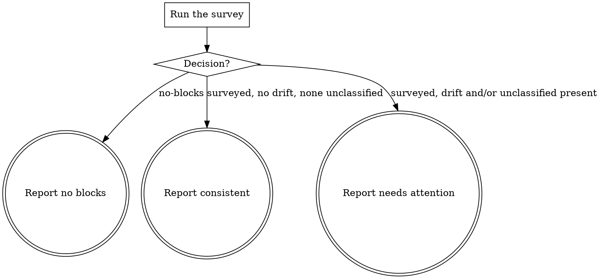

# eds-conventions-markup

This skill is dispatched by `eds-conventions`; it has no stage id of its own — core contract §4's
fifteen ids are closed, and this is an internal subagent of the `conventions` stage, not a stage.
It ends its own output with the subagent outcome block
(`../../../agentic-core/shared/subagent-outcome.md`), one tier further in than the `## Result`
block a stage adapter returns to the route driver.

## Input

None. This skill reads this project's own `blocks/*/*.css` files directly — nothing about which
item is being worked changes what this project's existing markup looks like.

## Flow



## Node Details

### Run the survey

Run:

```
bash ${CLAUDE_PLUGIN_ROOT}/skills/eds-conventions-markup/scripts/check-markup-conventions.sh .
```

This classifies every existing block's CSS by scoping form: the `.blockname .child` form (D30),
the bare `<blockname>` tag form a semantic-element block (`header`, `footer`) legitimately uses
instead, an `@scope` rule, or a `main .` prefix — and separately names any file whose selectors
matched none of the above (an empty or comment-only file, most often). It reports which files (if
any) drift from the dot/tag forms the majority use, and which files (if any) could not be
classified at all.

### Decision?

- `decision=no-blocks` → **Report no blocks**.
- `decision=surveyed …` with neither a `drift=` line nor a `review=` line → **Report consistent**.
- `decision=surveyed …` with a `drift=<names>` line and/or a `review=<names>` line → **Report
  needs attention**.

### Report no blocks

Emit the `## Outcome` block:

- `status: warning`
- `summary`: one sentence — this project has no existing blocks yet, so no scoping convention
  could be surveyed; the platform default (`.blockname .child`) applies until one exists.
- `artifacts: []`
- `next_action: none`

### Report consistent

Emit the `## Outcome` block:

- `status: success`
- `summary`: one sentence naming how many blocks were surveyed and that every one is scoped to its
  own block, by class or by its own semantic tag.
- `artifacts: []`
- `next_action: none`

### Report needs attention

Emit the `## Outcome` block:

- `status: warning`
- `summary`: one sentence combining both findings that apply — which blocks (by name) use a
  scoping form other than `.blockname .child`/bare-tag (the survey's own `drift=` line), and which
  blocks' CSS could not be classified at all (the survey's own `review=` line) — both verbatim,
  never reworded into something more general.
- `artifacts: []`
- `next_action: confirm before matching an inconsistent or unreviewed file's own scoping form`
