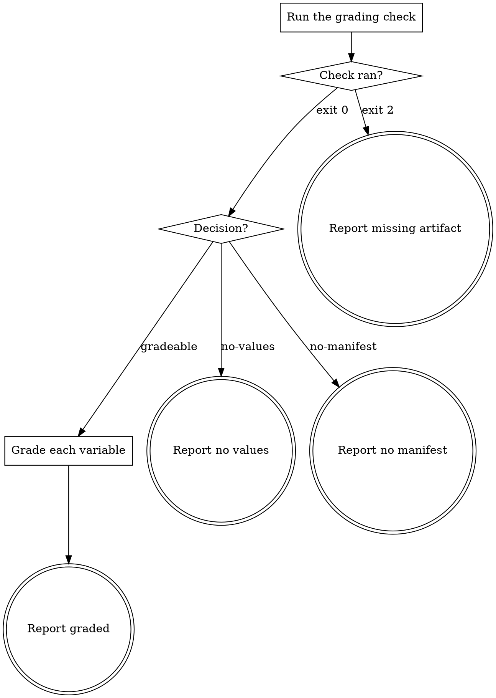

# eds-conventions-styles

This skill is dispatched by `eds-conventions`; it has no stage id of its own — core contract §4's
fifteen ids are closed, and this is an internal subagent of the `conventions` stage, not a stage.
It ends its own output with the subagent outcome block
(`../../../agentic-core/shared/subagent-outcome.md`), one tier further in than the `## Result`
block a stage adapter returns to the route driver.

## Input

None. This skill reads `.ai/run-context/design-reference.json` at its fixed path — the artifact
`extract` writes whenever this skill is dispatched at all, since both share the identical
fact-record condition (`design_source: true` or `design_mentioned: true`).

## Flow



## Node Details

### Run the grading check

Run:

```
bash ${CLAUDE_PLUGIN_ROOT}/skills/eds-conventions-styles/scripts/check-styles-grading.sh \
  .ai/run-context/design-reference.json .
```

This answers the two cases the contract already fixes outright — no design values retrieved, or
values retrieved but no design system adopted yet — before any judgment is needed. Only when both
exist does grading remain.

### Check ran?

- Exit `2` — `.ai/run-context/design-reference.json` is missing or not valid JSON, despite this
  skill only being dispatched when the fact record says a design reference exists. Go to **Report
  missing artifact**: this is `extract`'s artifact to have written, not something to reconstruct
  here.
- Exit `0` — go to **Decision?**.

### Decision?

- `decision=no-values` → **Report no values**.
- `decision=no-manifest` → **Report no manifest**.
- `decision=gradeable variables=<n>` → **Grade each variable**.

### Grade each variable

Read `.ai/run-context/design-reference.json`'s `variables` object and this project's own
`styles/design-system.md`. For each named variable, compare it against the adopted system (D20):

- **Matches** the adopted system — the project's own token already expresses this value; note it.
- **Drift** — the design's value disagrees with the adopted system's token for the same role — the
  design wins per D20, an override scoped to the block this item touches; note it.

Keep this to one short line per variable. It informs **Report graded**'s summary; it is not a
report of its own.

### Report missing artifact

Emit the `## Outcome` block:

- `status: failure`
- `summary`: one sentence — `.ai/run-context/design-reference.json` is missing or unreadable.
- `artifacts: []`
- `next_action: none`
- `blocker`: `extract` did not leave a readable `design-reference.json` for this item

### Report no values

Emit the `## Outcome` block:

- `status: warning`
- `summary`: one sentence — no design values were retrieved for this item, so there is nothing to
  grade; confidence capped low.
- `artifacts: []`
- `next_action: none`

### Report no manifest

Emit the `## Outcome` block:

- `status: warning`
- `summary`: one sentence — design values exist but this project has not adopted a design system
  yet, so there is nothing to grade against; confidence capped low.
- `artifacts: []`
- `next_action: run project onboarding before trusting a styles verdict`

### Report graded

Emit the `## Outcome` block:

- `status: success`
- `summary`: one sentence naming how many variables matched the adopted system and how many
  drifted — e.g. "Graded 2 design values against the adopted system: 1 matched, 1 drifted."
- `artifacts: []`
- `next_action: none`
