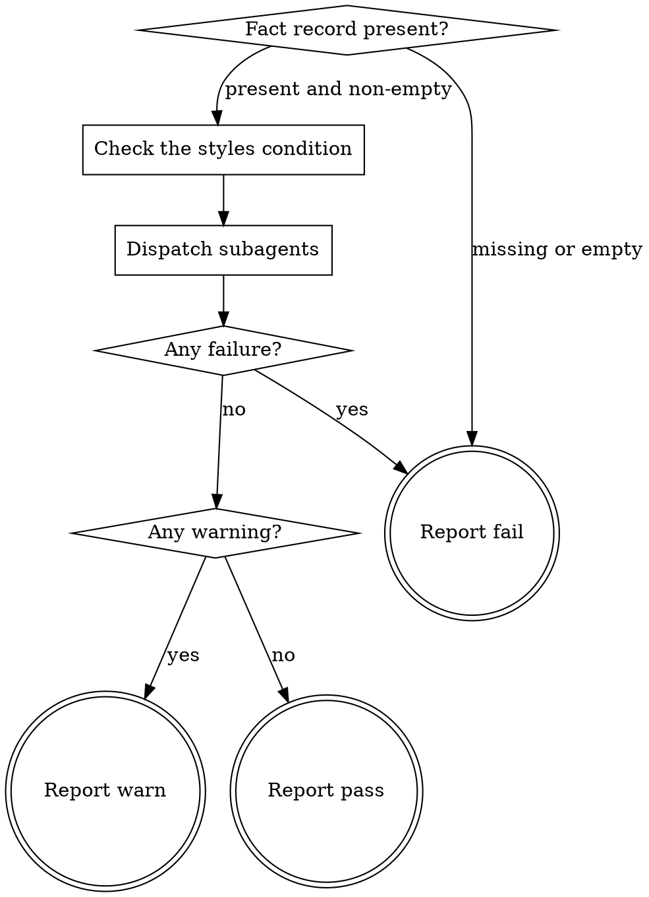

# eds-conventions

This stage always runs. It has no `tracker`/`scm`/`design`/`browser` role dependency — everything
it needs was already written by `intake` (and, when dispatched, by `extract`).

Read `../../../agentic-core/shared/fact-record.md` and `../../../agentic-core/shared/result-envelope.md`
for the shapes referenced below, and `../../../agentic-core/shared/subagent-outcome.md` for the
`## Outcome` block each of this stage's own three subagents ends with — a second, separate tier
from the `## Result` block this stage itself ends with.

## Input

None. This stage reads `.ai/run-context/fact-record.yaml` at its fixed path — the artifact
`intake` always writes.

## The three subagents

`04-eds-pack-design.md`'s D9/D75 names them: `styles`, `markup`, `component reuse`. `markup` and
`component reuse` always run. `styles` runs only when the fact record shows a design reference is
present or was requested — the same condition `extract`/`prototype`/`verify-design` already use —
because with neither field set there are no design values for it to grade.

Dispatch each by name with `Skill(<skill name>)`, the same mechanism the route driver uses to
dispatch this stage itself, one tier further in:

- `Skill(eds:eds-conventions-styles)` — only when dispatched (see **Check the styles condition**)
- `Skill(eds:eds-conventions-markup)` — always
- `Skill(eds:eds-conventions-component-reuse)` — always

Issue the calls this stage is dispatching together, in the same turn, rather than one at a time —
nothing about any of the three depends on another's result. Wait for every dispatched call to
return before branching on **Any failure?**/**Any warning?** below; this stage's own `## Result`
covers all of them, not the first to finish.

**If `Skill()` reports a subagent unknown, that is a contract violation** — treat it exactly as a
`status: failure` outcome from that subagent, with a `blocker` naming which one could not be
resolved. Do not paste that subagent's `SKILL.md` body into your own reasoning instead; an
unresolvable subagent is a configuration error to report, not a gap to route around.

## Flow



## Node Details

### Fact record present?

Read `.ai/run-context/fact-record.yaml`. Present and non-empty — go to **Check the styles
condition**. Missing or empty — go to **Report fail**: `intake` should have already run, and this
stage cannot research a project's conventions for an item it has no facts about.

### Check the styles condition

Run:

```
bash ${CLAUDE_PLUGIN_ROOT}/skills/eds-conventions/scripts/check-styles-condition.sh \
  .ai/run-context/fact-record.yaml
```

`decision=run` — dispatch `eds-conventions-styles` along with the other two. `decision=skip` —
dispatch only `eds-conventions-markup` and `eds-conventions-component-reuse`; a ticket with no
design source dispatches two subagents here, not three.

### Dispatch subagents

Invoke `Skill()` for each subagent this run includes (see **The three subagents** above). Capture
every `## Outcome` block returned — each subagent's `status`, `summary`, and (for a `failure`) its
`blocker` — for the next two nodes. Go to **Any failure?**.

### Any failure?

Any dispatched subagent returned `status: failure` — go to **Report fail**. None did — go to **Any
warning?**.

### Any warning?

Either way, first write `.ai/run-context/design-conventions.md` — one section per dispatched
subagent, each headed by the subagent's name and carrying its `## Outcome` `summary` verbatim (and,
for `styles`, the per-variable grading notes from that subagent's own reasoning, if it ran the
gradeable path). Note plainly which subagent(s), if any, were not dispatched (`styles`, when
skipped) rather than omitting them silently.

At least one dispatched subagent returned `status: warning` — go to **Report warn**. Every
dispatched subagent returned `status: success` — go to **Report pass**. This stage has no basis
for treating one subagent's warning as more or less serious than another's, so any warning at all
is enough to carry the stage's own verdict to `warn`.

### Report fail

Emit the `## Result` block:

- `verdict: fail`
- `summary`: one sentence — the missing-fact-record reason, or the failing subagent's own
  `blocker`, verbatim, never reworded into something more general.
- `artifacts: []`
- `next_action: none`

### Report warn

Emit the `## Result` block:

- `verdict: warn`
- `summary`: one sentence naming which subagent(s) reported a warning and why, drawn from their
  own `summary` fields.
- `artifacts`:
  - `.ai/run-context/design-conventions.md`
- `next_action: none`

### Report pass

Emit the `## Result` block:

- `verdict: pass`
- `summary`: one sentence naming that every dispatched subagent succeeded and, briefly, what each
  found.
- `artifacts`:
  - `.ai/run-context/design-conventions.md`
- `next_action: none`
