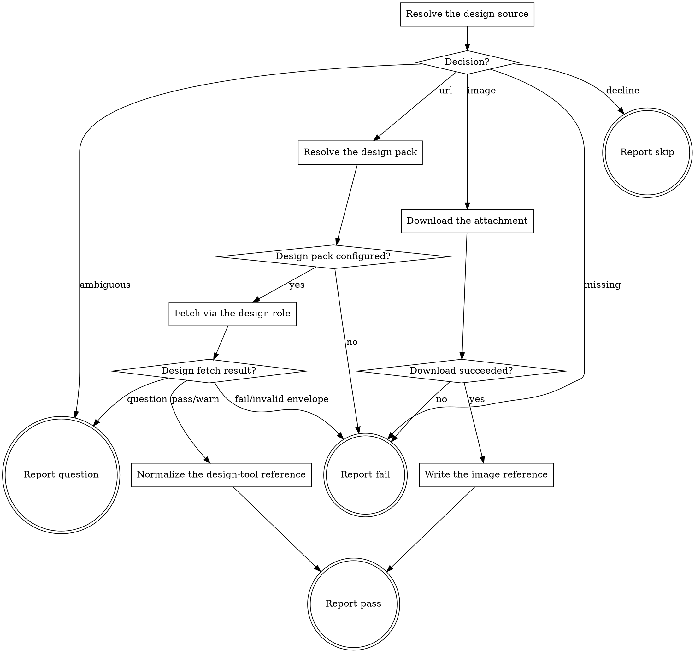

# eds-extract

This stage runs only when the fact record shows a design reference is present or one was
requested (`design_source: true` or `design_mentioned: true`). Core contract §6.1 names three
accepted design-source forms: a design-tool URL, another provider's URL resolved the same way, or
an image attached to the work item. The first two are resolved through the `design` role; the
third arrives through `tracker.fetch_item` — already fetched by `intake` — since an image is not a
design-tool reference at all.

**An image source yields a comparison target and no values.** This stage emits its own
`design-reference` artifact with that distinction made explicit (`has_values: false`,
`variables: null`) rather than as an empty or malformed result the next stage might misread as "a
design-tool reference that happens to use no variables" (`has_values: true`, `variables: {}` — a
different fact).

Read `../../../agentic-core/shared/fact-record.md` for the fact record's shape,
`../../../agentic-core/shared/pack-manifest.md` for the pack manifest shapes referenced below, and
`../../../agentic-core/shared/result-envelope.md` for the `## Result` block this stage must end
with.

## Input

None. This stage reads `.ai/run-context/fact-record.yaml` and `.ai/run-context/sanitized-spec.md`
at their fixed paths (both written by `intake`), and the raw fetched item JSON `intake`'s own
`tracker.fetch_item` call left on disk.

## Flow



## Node Details

### Resolve the design source

Run:

```
python3 ${CLAUDE_PLUGIN_ROOT}/skills/eds-extract/scripts/resolve-design-source.py \
  .ai/run-context/fact-record.yaml \
  .ai/run-context/sanitized-spec.md \
  .ai/tracker/fetch-item-<item_id>.json
```

substituting the fact record's own `item_id` for `<item_id>`. This script alone decides which of
§6.1's forms applies — a design-tool URL found in the sanitized text (the same detection this
pack's `intake` stage already applied, so this stage's belief about a URL's presence always agrees
with `design_source`), a single image attachment, more than one image attachment (irreducibly
ambiguous — nothing in the fact record or the fetched item says which one is the reference,
core contract §6.1/gap G36), or neither despite the fact record calling for one. Nothing in this
skill overrides or second-guesses that decision.

An exit code other than `0` is a usage error in this skill's own invocation, not a decision about
the item — go to **Report fail**, naming the usage error from stderr.

### Decision?

Read the script's `decision=` line from stdout.

- `decline` — neither `design_source` nor `design_mentioned` was `true`; this invocation's own
  `when:` condition does not hold. Go to **Report skip**. (Reached only on a standalone invocation
  outside a route — inside a route the runner never spawns this stage unless the condition already
  matched.)
- `url` — a design-tool URL was found; the line also carries `reference=<url>`. Go to **Resolve
  the design pack**.
- `image` — exactly one image attachment; the line also carries `filename=`, `content_url=` and
  `mime=`. Go to **Download the attachment**.
- `ambiguous` — more than one image attachment and no URL; the line also carries `count=` and
  `filenames=`. Go to **Report question**.
- `missing` — the fact record called for a design source but none was found. Go to **Report
  fail**: this is a fact-record/reality mismatch, not something this stage can resolve.

### Resolve the design pack

1. Read `.ai/project-config.yaml`'s `packs.design` value.
2. Absent or the literal `none` — this URL cannot be resolved without a design pack; continue to
   **Design pack configured?** with a "no" outcome.
3. Otherwise, that pack's manifest is a sibling of this skill's own plugin root:
   `${CLAUDE_PLUGIN_ROOT}/../<packs.design>/pack.yaml` (the same "installed pack = sibling
   directory of the plugin root" convention `eds-intake`'s own tracker resolution uses). Read that
   manifest's `operations.fetch_reference` value — the skill name implementing this role's
   operation. Absent, or listed under `unsupported` — continue to **Design pack configured?** with
   a "no" outcome; this is a configuration error pre-flight should have already caught, but extract
   has no fetch to attempt without it.
4. Both resolved — continue to **Design pack configured?** with a "yes" outcome.

### Design pack configured?

`yes` — go to **Fetch via the design role**. `no` — go to **Report fail**.

### Fetch via the design role

Invoke `Skill(<packs.design>:<fetch_reference skill name>)` with the invocation argument:

```
reference: <the url= value from the decision line>
```

Capture its entire output, ending with a `## Result` block.

### Design fetch result?

Read the captured envelope's `verdict`.

- `pass` or `warn` — continue to **Normalize the design-tool reference**, using the first path
  under the envelope's `artifacts:` list ending `.json` as the provider's reference data, and the
  first ending in an image extension as the provider's reference screenshot.
- `question` — go to **Report question**, relaying the provider's own `question`/`blocker`
  unchanged; extract itself could not resolve this and is raising it at its own stage boundary
  (core contract §3: "an adapter resolves what its own subagent could not, or raises its own
  `question` at its own boundary").
- `fail`, or an envelope that does not validate at all — go to **Report fail**.

### Normalize the design-tool reference

Run:

```
python3 ${CLAUDE_PLUGIN_ROOT}/skills/eds-extract/scripts/write-design-reference.py design_tool \
  "<the url= value from the decision line>" \
  <provider's reference JSON path> \
  <provider's reference image path> \
  .ai/run-context/design-reference.json \
  .ai/run-context/design-reference.png
```

This writes this pack's own `design-reference.json` — `source_kind: "design_tool"`,
`has_values: true`, the provider's `variables` and `geometry` carried through, and a copy of the
provider's reference image at this pack's own fixed path — never the provider's raw JSON returned
as-is (D34).

### Download the attachment

Run:

```
bash ${CLAUDE_PLUGIN_ROOT}/skills/eds-extract/scripts/download-attachment.sh \
  <the content_url= value from the decision line> \
  .ai/run-context/design-reference.<extension from mime=, e.g. png for image/png>
```

`JIRA_EMAIL`/`JIRA_API_TOKEN` must already be in the environment (the same credentials
`tracker.fetch_item` itself needs) — this finishes the retrieval `fetch_item` started rather than
opening a new one, per core contract §6.1's "arrives through tracker.fetch_item, not the design
role."

### Download succeeded?

Exit `0` — the file is on disk at the path given above. Continue to **Write the image reference**.
Exit `1` — stderr names why (missing credentials, a non-2xx response, curl itself failing). Go to
**Report fail**. Exit `2` — a usage error in this skill's own invocation. Go to **Report fail**.

### Write the image reference

Run:

```
python3 ${CLAUDE_PLUGIN_ROOT}/skills/eds-extract/scripts/write-design-reference.py image \
  "<the filename= value from the decision line>" \
  "<the mime= value from the decision line>" \
  <the path the previous node downloaded to> \
  .ai/run-context/design-reference.json
```

This writes `design-reference.json` with `source_kind: "image"`, `has_values: false`,
`variables: null`, `geometry: null` — §6.1's no-values case, represented explicitly rather than as
an empty result.

### Report skip

Emit the `## Result` block:

- `verdict: pass`
- `summary`: one sentence — this item's fact record names no design source and none was requested,
  so there was nothing to extract.
- `artifacts: []`
- `next_action: none`

### Report pass

Emit the `## Result` block:

- `verdict: pass`
- `summary`: one sentence naming the source kind (`design_tool` or `image`) and, for a design-tool
  source, how many variables were retrieved.
- `artifacts`:
  - `.ai/run-context/design-reference.json`
  - `.ai/run-context/design-reference.png` (or whatever extension the image case wrote)
- `next_action: none`
- `metrics: has_values=true|false`

### Report question

Emit the `## Result` block:

- `verdict: question`
- `summary`: one sentence — either "more than one image attachment, none marked as the design
  reference" (the `ambiguous` decision) or the design provider's own question summary, relayed
  unchanged (the provider-question path).
- `artifacts: []`
- `next_action: none`
- `question`: for `ambiguous`, ask which attachment (naming each by filename from `filenames=`) is
  the design reference; for a relayed provider question, that provider's own `question` text
  unchanged.
- `blocker`: for `ambiguous`, "more than one image attachment, none identified as the design
  reference"; for a relayed provider question, that provider's own `blocker` text unchanged.

### Report fail

Emit the `## Result` block:

- `verdict: fail`
- `summary`: one sentence naming what went wrong — the usage error from **Resolve the design
  source**; the `missing` decision naming that the fact record called for a design source none
  could be found; the unconfigured `packs.design`; the design provider's own `fail` summary
  relayed unchanged; or the download failure's stderr line. Never guessed or reworded into
  something more general.
- `artifacts: []`
- `next_action: none`

## Known limitations

- **The design-tool-URL branch shares `intake`'s own detection limits.** A URL that appears only
  as a link's target (an ADF `link` mark whose visible text differs from its `href`) is invisible
  to both `intake`'s `design_source` computation and this stage's own search, because both read the
  identical flattened plain text. A work item whose only design reference is such a link sets
  `design_source: false` and never reaches this stage's URL path at all — a gap in what `intake`
  hands this stage, not something this adapter can recover on its own.
- **The `ambiguous` question path duplicates, at this stage's own boundary, the `question` core
  contract §6.1 specifies for `readiness`** (gap G36) — `readiness` does not implement it (its own
  known limitation: the fact record cannot tell an image-only item from a URL-backed one, let alone
  name the attachments). Raising it here instead is a legitimate stage-boundary `question` (§3), not
  a substitute for fixing `readiness` — an item whose design source is unambiguous (one image, or a
  resolvable URL) never reaches a human a run earlier than it has to; one that is genuinely
  ambiguous still gets asked, just one stage later than the contract's ideal.
