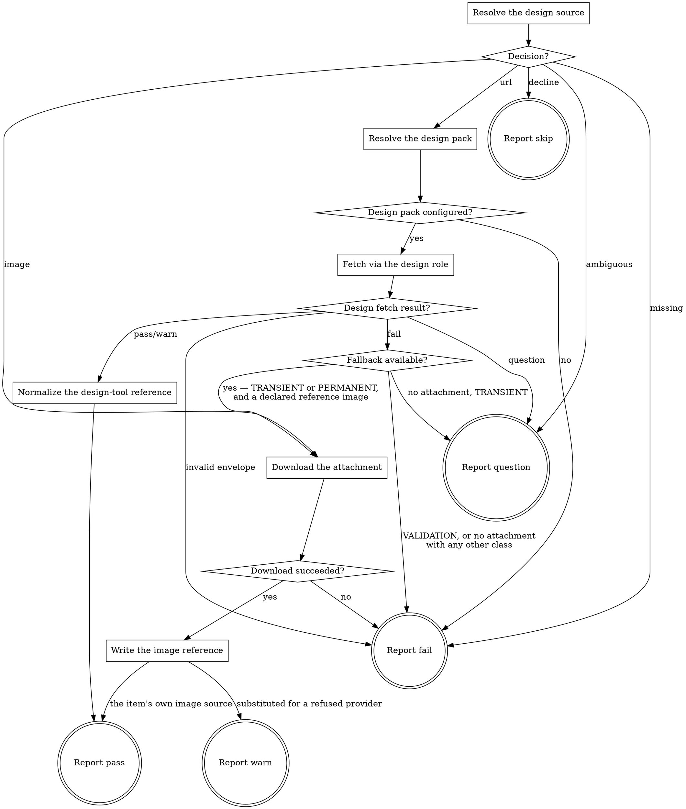

# eds-extract

This stage runs only when the fact record shows a design reference is present or one was
requested (`design_source: true` or `design_mentioned: true`). Core contract §6.1 names three
accepted design-source forms: a design-tool URL, another provider's URL resolved the same way, or
an image attached to the work item. The first two are resolved through the `design` role; the
third arrives through `tracker.fetch_item` — already fetched by `intake` — since an image is not a
design-tool reference at all.

**An image source yields a comparison target and no values.** This stage emits its own
`design-reference` artifact with that distinction made explicit (`has_values: false`,
`variables: null`) rather than as an empty or malformed result the next stage might misread as "a
design-tool reference that happens to use no variables" (`has_values: true`, `variables: {}` — a
different fact).

Read `../../../agentic-core/shared/fact-record.md` for the fact record's shape,
`../../../agentic-core/shared/pack-manifest.md` for the pack manifest shapes referenced below, and
`../../../agentic-core/shared/result-envelope.md` for the `## Result` block this stage must end
with.

## Input

None. This stage reads `.ai/run-context/fact-record.yaml` and `.ai/run-context/sanitized-spec.md`
at their fixed paths (both written by `intake`), and the raw fetched item JSON `intake`'s own
`tracker.fetch_item` call left on disk.

## Flow



## Node Details

### Resolve the design source

Run:

```
python3 ${CLAUDE_PLUGIN_ROOT}/skills/eds-extract/scripts/resolve-design-source.py \
  .ai/run-context/fact-record.yaml \
  .ai/run-context/sanitized-spec.md \
  .ai/tracker/fetch-item-<item_id>.json
```

substituting the fact record's own `item_id` for `<item_id>`. This script alone decides which of
§6.1's forms applies — a design-tool URL found in the sanitized text (the same detection this
pack's `intake` stage already applied, so this stage's belief about a URL's presence always agrees
with `design_source`), an image attachment resolved as this item's design reference, an image set
that resolves to no single reference (irreducibly ambiguous — nothing the script may act on says
which one it is, core contract §6.1/gap G36), or neither despite the fact record calling for one.
Nothing in this skill overrides or second-guesses that decision.

An exit code other than `0` is a usage error in this skill's own invocation, not a decision about
the item — go to **Report fail**, naming the usage error from stderr.

### Decision?

Read the script's `decision=` line from stdout.

- `decline` — neither `design_source` nor `design_mentioned` was `true`; this invocation's own
  `when:` condition does not hold. Go to **Report skip**. (Reached only on a standalone invocation
  outside a route — inside a route the runner never spawns this stage unless the condition already
  matched.)
- `url` — a design-tool URL was found; the line also carries `reference=<url>`, and, when the item
  additionally carries a resolved fallback image, `fallback_image=`, `fallback_url=` and
  `fallback_mime=`. Keep those three values: nothing reads them unless the provider refuses, and
  **Fallback available?** is the only node that does. Go to **Resolve the design pack**. A URL is
  this item's design source whatever its attachments look like, so a URL never arrives as
  `ambiguous`.
- `image` — no URL, and the item's images resolved to one design reference; the line also carries
  `filename=`, `content_url=` and `mime=`. Go to **Download the attachment**.
- `ambiguous` — no URL, and the item's images did not resolve to one design reference; the line
  also carries `count=` and `filenames=`, listing every image the item carries. Go to **Report
  question**.
- `missing` — the fact record called for a design source but none was found. Go to **Report
  fail**: this is a fact-record/reality mismatch, not something this stage can resolve.

### Resolve the design pack

1. Read `.ai/project-config.yaml`'s `packs.design` value.
2. Absent or the literal `none` — this URL cannot be resolved without a design pack; continue to
   **Design pack configured?** with a "no" outcome.
3. Otherwise, that pack's manifest is a sibling of this skill's own plugin root:
   `${CLAUDE_PLUGIN_ROOT}/../<packs.design>/pack.yaml` (the same "installed pack = sibling
   directory of the plugin root" convention `eds-intake`'s own tracker resolution uses). Read that
   manifest's `operations.fetch_reference` value — the skill name implementing this role's
   operation. Absent, or listed under `unsupported` — continue to **Design pack configured?** with
   a "no" outcome; this is a configuration error pre-flight should have already caught, but extract
   has no fetch to attempt without it.
4. Both resolved — continue to **Design pack configured?** with a "yes" outcome.

### Design pack configured?

`yes` — go to **Fetch via the design role**. `no` — go to **Report fail**.

### Fetch via the design role

Invoke `Skill(<packs.design>:<fetch_reference skill name>)` with the invocation argument:

```
reference: <the url= value from the decision line>
```

Capture its entire output, ending with a `## Result` block.

### Design fetch result?

Read the captured envelope's `verdict`.

- `pass` or `warn` — continue to **Normalize the design-tool reference**, using the first path
  under the envelope's `artifacts:` list ending `.json` as the provider's reference data, and the
  first ending in an image extension as the provider's reference screenshot.
- `question` — go to **Report question**, relaying the provider's own `question`/`blocker`
  unchanged; extract itself could not resolve this and is raising it at its own stage boundary
  (core contract §3: "an adapter resolves what its own subagent could not, or raises its own
  `question` at its own boundary").
- `fail` — go to **Fallback available?**. This stage does not turn a provider's failure into its
  own before asking whether it has another way to get a reference.
- An envelope that does not validate at all — go to **Report fail**. There is no trustworthy
  `error_class` to read off a block that is not a conformant envelope, and guessing one would be
  guessing whether substitution is permitted.

### Fallback available?

Two values decide this, and both are already in hand: the `fallback_url=` the decision line carried
(or did not), and the `error_class` on the provider's own envelope. See
`../../../agentic-core/shared/error-handling.md` for what each class means.

- The decision line carried `fallback_url=` **and** the envelope's `error_class` is `TRANSIENT` or
  `PERMANENT` — go to **Download the attachment**, using the `fallback_url=` and `fallback_mime=`
  values in place of the `content_url=` and `mime=` that node reads on the `image` path. Both of
  those classes describe **the provider**: it is busy, or it cannot run here. The reference the
  item named is not in question, so putting the item's own attached image in its place is a
  substitution the item already sanctions.
- The envelope's `error_class` is `VALIDATION` — go to **Report fail**, exactly as this stage did
  before the fallback existed, whether or not an attachment exists. `VALIDATION` describes **the
  request**: the reference this item named is wrong. Substituting a different artifact for one the
  item explicitly named would answer a question nobody asked.
- No `fallback_url=` on the decision line, and the class is `TRANSIENT` — go to **Report question**.
  The reference could not be fetched, the item carries no usable image, and a human doing one
  concrete thing is what unblocks it. This is the escalation the provider operation deliberately
  did not raise: it could not see whether this stage had an alternative, and this node is where
  that is known.
- No `fallback_url=`, and any other class — go to **Report fail**, exactly as today.

The rule the four branches share, stated once: **`TRANSIENT` and `PERMANENT` describe the provider
and permit substitution; `VALIDATION` describes the request and forbids it.**

An envelope carrying no `error_class` at all is read as "no class known" and takes the last branch:
an unclassified failure is not evidence that substitution is safe.

### Normalize the design-tool reference

Run:

```
python3 ${CLAUDE_PLUGIN_ROOT}/skills/eds-extract/scripts/write-design-reference.py design_tool \
  "<the url= value from the decision line>" \
  <provider's reference JSON path> \
  <provider's reference image path> \
  .ai/run-context/design-reference.json \
  .ai/run-context/design-reference.png
```

This writes this pack's own `design-reference.json` — `source_kind: "design_tool"`,
`has_values: true`, the provider's `variables` and `geometry` carried through, and a copy of the
provider's reference image at this pack's own fixed path — never the provider's raw JSON returned
as-is (D34).

### Download the attachment

Run:

```
bash ${CLAUDE_PLUGIN_ROOT}/skills/eds-extract/scripts/download-attachment.sh \
  <the content_url= value from the decision line> \
  .ai/run-context/design-reference.<extension from mime=, e.g. png for image/png>
```

`JIRA_EMAIL`/`JIRA_API_TOKEN` must already be in the environment (the same credentials
`tracker.fetch_item` itself needs) — this finishes the retrieval `fetch_item` started rather than
opening a new one, per core contract §6.1's "arrives through tracker.fetch_item, not the design
role."

### Download succeeded?

Exit `0` — the file is on disk at the path given above. Continue to **Write the image reference**.
Exit `1` — stderr names why (missing credentials, a non-2xx response, curl itself failing). Go to
**Report fail**. Exit `2` — a usage error in this skill's own invocation. Go to **Report fail**.

### Write the image reference

Run:

```
python3 ${CLAUDE_PLUGIN_ROOT}/skills/eds-extract/scripts/write-design-reference.py image \
  "<the filename= value from the decision line>" \
  "<the mime= value from the decision line>" \
  <the path the previous node downloaded to> \
  .ai/run-context/design-reference.json
```

This writes `design-reference.json` with `source_kind: "image"`, `has_values: false`,
`variables: null`, `geometry: null` — §6.1's no-values case, represented explicitly rather than as
an empty result. It is the same artifact on both paths into this node, which is the point: every
downstream consumer already honors `has_values: false`, so none of them has to learn that a
substitution happened.

Where this node was reached from decides which terminal follows, and nothing else does:

- From **Decision?**'s `image` edge — the item's own design source is an image, which is what it
  always was. Go to **Report pass**.
- From **Fallback available?** — the item named a design-tool reference and this stage could not
  retrieve it. Go to **Report warn**.

### Report skip

Emit the `## Result` block as plain `key: value` lines per `../../../agentic-core/shared/result-envelope.md` — never as a bulleted or backtick-wrapped list, with `verdict:` as the very next line, nothing between it and the heading, and never followed by anything else — not even a summary explicitly labeled as commentary or "not part of the envelope"; if that's worth writing, put it before the heading instead, where it is already sanctioned. Fields:

- `verdict: pass`
- `summary`: one sentence, 200 characters or fewer (the envelope's hard cap — an oversized summary fails validation and takes the whole run to `failed`) — this item's fact record names no design source and none was requested,
  so there was nothing to extract.
- `artifacts: []`
- `next_action: none`

### Report pass

Emit the `## Result` block as plain `key: value` lines per `../../../agentic-core/shared/result-envelope.md` — never as a bulleted or backtick-wrapped list, with `verdict:` as the very next line, nothing between it and the heading, and never followed by anything else — not even a summary explicitly labeled as commentary or "not part of the envelope"; if that's worth writing, put it before the heading instead, where it is already sanctioned. Fields:

- `verdict: pass`
- `summary`: one sentence, 200 characters or fewer (the envelope's hard cap — an oversized summary fails validation and takes the whole run to `failed`) naming the source kind (`design_tool` or `image`) and, for a design-tool
  source, how many variables were retrieved.
- `artifacts`:
  - `.ai/run-context/design-reference.json`
  - `.ai/run-context/design-reference.png` (or whatever extension the image case wrote)
- `next_action: none`
- `metrics: has_values=true|false`

### Report warn

The reference this item named was not retrieved, and the item's own attached image was used in its
place. Reporting `pass` here would tell the run's status line that the named design reference was
read, when it was not; the run still continues, because a visual-only reference is a reference.

Emit the `## Result` block as plain `key: value` lines per `../../../agentic-core/shared/result-envelope.md` — never as a bulleted or backtick-wrapped list, with `verdict:` as the very next line, nothing between it and the heading, and never followed by anything else — not even a summary explicitly labeled as commentary or "not part of the envelope"; if that's worth writing, put it before the heading instead, where it is already sanctioned. Fields:

- `verdict: warn`
- `summary`: one sentence, 200 characters or fewer (the envelope's hard cap — an oversized summary fails validation and takes the whole run to `failed`) naming **both** halves — the provider failure that
  happened, with its class, and the attachment used instead. One without the other hides which of
  the two this run actually did.
- `artifacts`:
  - `.ai/run-context/design-reference.json`
  - `.ai/run-context/design-reference.<extension>`
- `next_action: none`
- `metrics: has_values=false fallback=attachment`

`fallback=attachment` is what distinguishes an item that always was image-only from one that was
demoted to image-only. `has_values=false` alone cannot: both cases carry it.

This node reports no `error_class`. The failure was classified and then recovered from; an
`error_class` on anything but a `fail` or a `question` is a contract violation the envelope
validator rejects.

### Report question

Emit the `## Result` block as plain `key: value` lines per `../../../agentic-core/shared/result-envelope.md` — never as a bulleted or backtick-wrapped list, with `verdict:` as the very next line, nothing between it and the heading, and never followed by anything else — not even a summary explicitly labeled as commentary or "not part of the envelope"; if that's worth writing, put it before the heading instead, where it is already sanctioned. Fields:

- `verdict: question`
- `summary`: one sentence, 200 characters or fewer (the envelope's hard cap — an oversized summary fails validation and takes the whole run to `failed`) — one of: "the item's images name no design
  reference" (the `ambiguous` decision); the design provider's own question summary, relayed
  unchanged (the provider-question path); or the provider's transient failure with no attachment to
  fall back to (the **Fallback available?** path).
- `artifacts: []`
- `next_action: none`
- `question`: for `ambiguous`, ask which of the attachments (naming each by filename from
  `filenames=`) is the design reference; for a relayed provider question, that provider's own
  `question` text unchanged; from **Fallback available?**, whether to wait for the provider or to
  attach the design reference to the work item.
- `blocker`: **the literal action that unblocks it** — never "investigate the provider failure": a
  blocker names a thing a reader can do, not a thing to look into. For `ambiguous`: attach the
  design reference to the work item named `design-reference.png` (or `design-reference.jpg` or
  `design-reference.jpeg`), or rename the attachment that already is one — an image under any other
  name is not read as the reference, however few of them there are. For a relayed provider
  question, that provider's own `blocker` text unchanged. From **Fallback available?**: wait out
  the named quota or rate-limit window, or attach the design reference to the work item named
  `design-reference.png` (or `design-reference.jpg` or `design-reference.jpeg`).
- `error_class`: on the **Fallback available?** path only, `TRANSIENT` — the class that brought the
  flow here, carried through so the run's own record shows why this became a question. The
  `ambiguous` and relayed-provider-question paths carry no class: the first classifies nothing, and
  the second relays a question the provider already chose to raise.

### Report fail

Emit the `## Result` block as plain `key: value` lines per `../../../agentic-core/shared/result-envelope.md` — never as a bulleted or backtick-wrapped list, with `verdict:` as the very next line, nothing between it and the heading, and never followed by anything else — not even a summary explicitly labeled as commentary or "not part of the envelope"; if that's worth writing, put it before the heading instead, where it is already sanctioned. Fields:

- `verdict: fail`
- `summary`: one sentence, 200 characters or fewer (the envelope's hard cap — an oversized summary fails validation and takes the whole run to `failed`) naming what went wrong — the usage error from **Resolve the design
  source**; the `missing` decision naming that the fact record called for a design source none
  could be found; the unconfigured `packs.design`; the design provider's own `fail` summary
  relayed unchanged; or the download failure's stderr line. Never guessed or reworded into
  something more general.
- `artifacts: []`
- `next_action: none`
- `error_class`: on the **Fallback available?** path, the class the provider's envelope carried —
  `VALIDATION` where the reference itself was wrong, or `PERMANENT` where no attachment was
  available to substitute. On every other path into this node, the class this stage determined for
  its own failure: `VALIDATION` for the `missing` decision and for an envelope that does not
  validate, `PERMANENT` for an unconfigured `packs.design` and for a failed attachment download.

## Known limitations

- **The design-tool-URL branch shares `intake`'s own detection limits.** A URL that appears only
  as a link's target (an ADF `link` mark whose visible text differs from its `href`) is invisible
  to both `intake`'s `design_source` computation and this stage's own search, because both read the
  identical flattened plain text. A work item whose only design reference is such a link sets
  `design_source: false` and never reaches this stage's URL path at all — a gap in what `intake`
  hands this stage, not something this adapter can recover on its own.
- **The `ambiguous` question path duplicates, at this stage's own boundary, the `question` core
  contract §6.1 specifies for `readiness`** (gap G36) — `readiness` does not implement it (its own
  known limitation: the fact record cannot tell an image-only item from a URL-backed one, let alone
  name the attachments). Raising it here instead is a legitimate stage-boundary `question` (§3), not
  a substitute for fixing `readiness` — an item whose design source is unambiguous (a declared
  reference image, or a resolvable URL) never reaches a human a run earlier than it has to; one that is genuinely
  ambiguous still gets asked, just one stage later than the contract's ideal.
