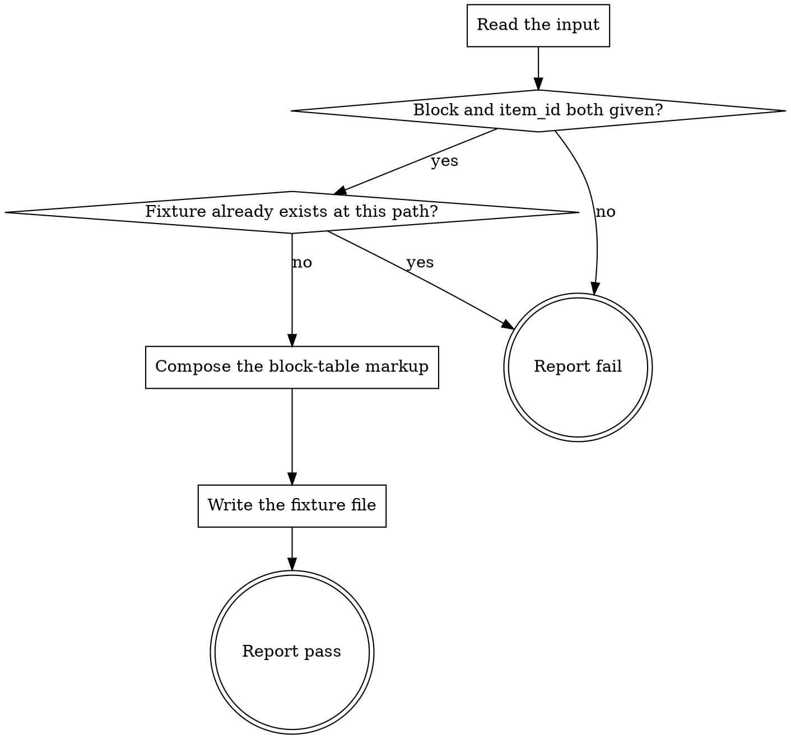

# eds-fixture

This skill is not one of the core's fifteen stage ids and not a `tracker`/`scm`/`design`/`browser`
role operation — none of the four roles has a content-generation verb, and "generate a fixture" is
not in the closed stage vocabulary either. It is a standalone helper this pack ships alongside its
stage adapters, invoked by name (`Skill(eds:eds-fixture)`) by whatever needs one: a stage adapter
that finds nothing to render, or a human preparing a unit for local development. See D70
(`04-eds-pack-design.md`) for why it is shaped this way, and G48 for what does not call it yet.

Read `../../../agentic-core/shared/result-envelope.md` for the `## Result` block this skill must
end with.

**What this skill does not do.** It does not infer, guess, or fetch real content for the block —
doing so would require judging what the block is for, which is exactly the kind of invention D8's
own `.plain.html` reasoning exists to avoid. Every cell it writes is placeholder text that names its
own row and column, so a generated fixture is never mistaken for authored copy. A caller with real
content to author writes it by hand, or through `eds-implement`'s own conventions — this skill
exists only for the case where nothing would otherwise be there to render at all.

## Input

```
block: <the target block's folder/class name, required>
item_id: <the work item id, required — becomes the output filename>
rows: <positive integer, optional, default 2>
columns: <positive integer, optional, default 2>
```

`rows`/`columns` default to 2×2 — the shape a title+body or image+text block needs, and a
reasonable minimum for a block whose own decoration logic expects more than one cell per row.
Nothing in this project's fact record or plan is read directly; a caller that has one (an
`eds-verify` invocation that just found nothing to render, for instance) passes what it already
knows as `block`/`item_id` rather than this skill re-deriving them.

## Flow



## Node Details

### Read the input

Read `block`, `item_id`, and the optional `rows`/`columns` (default 2 each if omitted). Reject an
`item_id` containing `/` or `..` — it becomes a path segment below, and this skill only ever writes
inside `drafts/`, never outside it.

### Block and item_id both given?

Both present and non-empty, and `item_id` passed the path check above — continue to **Fixture
already exists at this path?**. Either missing, or `item_id` rejected — go to **Report fail**: this
skill has nothing to name the block or the output file with.

### Fixture already exists at this path?

Compute the output path `drafts/<item_id>.plain.html`. Absent — continue to **Compose the
block-table markup**. Present — go to **Report fail**: a path already occupied means either real
authored content or a previous fixture, and this skill has no way to tell which, so it does not
overwrite it. A caller that wants a fresh fixture deletes the existing file first, or passes a
different `item_id`.

### Compose the block-table markup

Build the authored form `scripts/aem.js`'s `decorateSections`/`decorateBlocks` expect from a plain
document — a block is a direct child of its section, not wrapped further; `decorateSections` adds
the intermediate wrapper div itself at decoration time:

```html
<div>
  <div class="<block>">
    <div>
      <div><block> fixture — row 1, cell 1</div>
      <div><block> fixture — row 1, cell 2</div>
    </div>
    <div>
      <div><block> fixture — row 2, cell 1</div>
      <div><block> fixture — row 2, cell 2</div>
    </div>
  </div>
</div>
```

One outer `<div>` (the section), containing one `<div class="<block>">` (the block), containing one
`<div>` per `rows` (a table row), each containing one `<div>` per `columns` (a cell), each cell's
text literally `<block> fixture — row <r>, cell <c>` with `<r>`/`<c>` the 1-based row/column index.

### Write the fixture file

Create `drafts/` if it does not already exist. Write the composed markup to
`drafts/<item_id>.plain.html`.

### Report fail

Emit the `## Result` block:

- `verdict: fail`
- `summary`: one sentence — either that `block` or `item_id` was missing or `item_id` failed the
  path check, or that a fixture already exists at the target path (naming it).
- `artifacts: []`
- `next_action: none`

### Report pass

Emit the `## Result` block:

- `verdict: pass`
- `summary`: one sentence naming the block, the item id, and the rows×columns generated.
- `artifacts`: `[drafts/<item_id>.plain.html]`
- `next_action: none`
