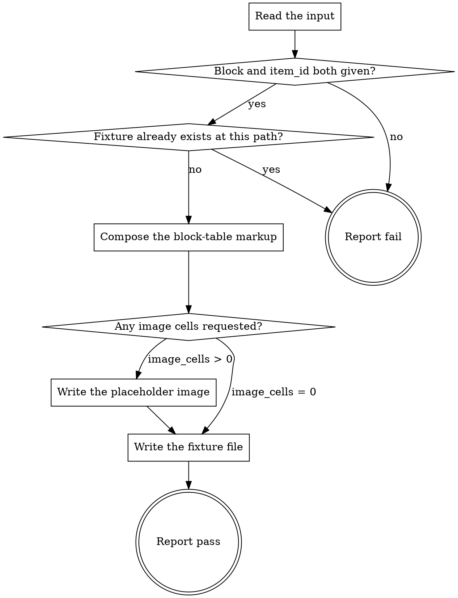

# eds-fixture

This skill is not one of the core's fifteen stage ids and not a `tracker`/`scm`/`design`/`browser`
role operation — none of the four roles has a content-generation verb, and "generate a fixture" is
not in the closed stage vocabulary either. It is a standalone helper this pack ships alongside its
stage adapters, invoked by name (`Skill(eds:eds-fixture)`) by whatever needs one: `eds-verify`
invokes it as a fallback from its own **Renderable content found?** node when nothing exists yet to
render, and a human preparing a unit for local development can invoke it the same way. See D70 for
why it is shaped this way.

Read `../../../agentic-core/shared/result-envelope.md` for the `## Result` block this skill must
end with.

**What this skill does not do.** It does not infer, guess, or fetch real content for the block —
doing so would require judging what the block is for, which is exactly the kind of invention D8's
own `.plain.html` reasoning exists to avoid. Every cell it writes is placeholder text that names its
own row and column, so a generated fixture is never mistaken for authored copy. A caller with real
content to author writes it by hand, or through `eds-implement`'s own conventions — this skill
exists only for the case where nothing would otherwise be there to render at all.

## Input

```
block: <the target block's folder/class name, required>
item_id: <the work item id, required — becomes the output filename>
rows: <positive integer, optional, default 2>
columns: <positive integer, optional, default 2>
image_cells: <non-negative integer, optional, default 0>
```

`image_cells` is how many cells at the **start of each row** carry a generated placeholder picture
instead of placeholder text. A block whose own decoration looks for `picture > img` renders with
nothing to find otherwise, so any check about image behaviour observes an empty list and silently
reports nothing.

**It defaults to `0`, which leaves output byte-identical to a caller that never passes it**, and
that default is deliberate rather than cautious: a cell containing *only* a picture is exactly what
makes `cards.js` classify a div as `cards-card-image` and `columns.js` as `columns-img-col`. Adding
images unconditionally would quietly change the classification every existing fixture produces, and
so change what every existing caller is measuring.

`rows`/`columns` default to 2×2 — the shape a title+body or image+text block needs, and a
reasonable minimum for a block whose own decoration logic expects more than one cell per row.
Nothing in this project's fact record or plan is read directly; a caller that has one (an
`eds-verify` invocation that just found nothing to render, for instance) passes what it already
knows as `block`/`item_id` rather than this skill re-deriving them.

## Flow



## Node Details

### Read the input

Read `block`, `item_id`, and the optional `rows`/`columns` (default 2 each if omitted). Reject an
`item_id` containing `/` or `..` — it becomes a path segment below, and this skill only ever writes
inside `drafts/`, never outside it.

### Block and item_id both given?

Both present and non-empty, and `item_id` passed the path check above — continue to **Fixture
already exists at this path?**. Either missing, or `item_id` rejected — go to **Report fail**: this
skill has nothing to name the block or the output file with.

### Fixture already exists at this path?

Compute the output path `drafts/<item_id>.plain.html`. Absent — continue to **Compose the
block-table markup**. Present — go to **Report fail**: a path already occupied means either real
authored content or a previous fixture, and this skill has no way to tell which, so it does not
overwrite it. A caller that wants a fresh fixture deletes the existing file first, or passes a
different `item_id`.

### Compose the block-table markup

Build the authored form `scripts/aem.js`'s `decorateSections`/`decorateBlocks` expect from a plain
document — a block is a direct child of its section, not wrapped further; `decorateSections` adds
the intermediate wrapper div itself at decoration time:

```html
<div>
  <div class="<block>">
    <div>
      <div><block> fixture — row 1, cell 1</div>
      <div><block> fixture — row 1, cell 2</div>
    </div>
    <div>
      <div><block> fixture — row 2, cell 1</div>
      <div><block> fixture — row 2, cell 2</div>
    </div>
  </div>
</div>
```

One outer `<div>` (the section), containing one `<div class="<block>">` (the block), containing one
`<div>` per `rows` (a table row), each containing one `<div>` per `columns` (a cell), each cell's
text literally `<block> fixture — row <r>, cell <c>` with `<r>`/`<c>` the 1-based row/column index.

**With `image_cells` greater than zero.** The first `image_cells` cells of every row carry a picture instead of that text; the remaining
cells keep the wording above, unchanged. An image cell contains **only** the picture, nothing
else:

```html
<div><picture>-fixture-image.svg" alt="<block> fixture image — row <r>, cell <c>" width="1600" height="900"></picture></div>
```

Picture-only because that is precisely what a block's own decoration tests for when it decides a
cell is an image cell — add a stray text node beside it and `cards.js` classifies the div as a
body cell instead, which is not the shape real authored content has.

**The block goes in the *second* section, after a one-line text section.** When `image_cells` is
zero the block is the only section, as before; when it is greater than zero, emit a leading
section first:

```html
<div>
  <p><block> fixture — leading section, so the block under test is not the page's first section</p>
</div>
<div>
  <div class="<block>">
    …
```

This one is worth understanding rather than copying, because it is the difference between a check
and a check-shaped no-op. `scripts/scripts.js` passes `waitForFirstImage` as the load callback for
the **first section only**, and that function sets `loading="eager"` on that section's first
`` *after* the block's own decoration has already run. A block under test in the first section
therefore reports `eager` on its first image whether or not the code being reviewed does anything
at all — so an assertion about eager-versus-lazy cannot fail there, and a check that cannot fail is
not a check. Measured both ways on a rendered probe before this rule was written: identical block,
first section versus second, and only the second isolates the block's own behaviour.

### Any image cells requested?

`image_cells` greater than zero — go to **Write the placeholder image**. Zero (or omitted) — go
straight to **Write the fixture file**; no image file is written and none is referenced.

### Write the placeholder image

Create `drafts/` if it does not already exist, then write this file, verbatim, to
`drafts/<item_id>-fixture-image.svg`:

```svg
<svg xmlns="http://www.w3.org/2000/svg" viewBox="0 0 1600 900" width="1600" height="900" role="img" aria-label="fixture placeholder image">
  <rect width="1600" height="900" fill="#d8dee9"/>
  <text x="800" y="470" text-anchor="middle" font-family="monospace" font-size="72" fill="#4c566a">fixture placeholder</text>
</svg>
```

Two things about this file are deliberate. **Its face reads `fixture placeholder`**, for the same
reason every text cell names its own row and column: a generated fixture must never be mistaken
for authored copy, and an image is the easiest thing to mistake. **It is SVG**, because SVG is
text — no binary payload in a skill file, no base64, and the bytes are identical every run.

A `data:` URI would be self-contained and needs no file at all, which makes it the obvious
alternative and the wrong one: `createOptimizedPicture` splits a `src` into `origin` + `pathname`
and rebuilds `${origin}${pathname}?width=…`, which for a `data:` URL produces `null` followed by
the whole payload — a malformed request and a broken image. A served file survives that rebuild;
measured, the rebuilt URL returns 200 and the image loads.

### Write the fixture file

Create `drafts/` if it does not already exist. Write the composed markup to
`drafts/<item_id>.plain.html`.

### Report fail

Emit the `## Result` block as plain `key: value` lines per `../../../agentic-core/shared/result-envelope.md` — never as a bulleted or backtick-wrapped list, with `verdict:` as the very next line, nothing between it and the heading, and never followed by anything else — not even a summary explicitly labeled as commentary or "not part of the envelope"; if that's worth writing, put it before the heading instead, where it is already sanctioned. Fields:

- `verdict: fail`
- `summary`: one sentence, 200 characters or fewer (the envelope's hard cap — an oversized summary fails validation and takes the whole run to `failed`) — either that `block` or `item_id` was missing or `item_id` failed the
  path check, or that a fixture already exists at the target path (naming it).
- `artifacts: []`
- `next_action: none`

### Report pass

Emit the `## Result` block as plain `key: value` lines per `../../../agentic-core/shared/result-envelope.md` — never as a bulleted or backtick-wrapped list, with `verdict:` as the very next line, nothing between it and the heading, and never followed by anything else — not even a summary explicitly labeled as commentary or "not part of the envelope"; if that's worth writing, put it before the heading instead, where it is already sanctioned. Fields:

- `verdict: pass`
- `summary`: one sentence, 200 characters or fewer (the envelope's hard cap — an oversized summary fails validation and takes the whole run to `failed`) naming the block, the item id, and the rows×columns generated, and how many image cells per row when `image_cells` was greater than zero.
- `artifacts` (always a YAML list — `artifacts:` then `  - <path>` per line; even a single path is a list, never an inline scalar): `drafts/<item_id>.plain.html`, plus `drafts/<item_id>-fixture-image.svg` when an image was written — a caller that has to clean up after a fixture needs both paths, not just the one.
- `next_action: none`
