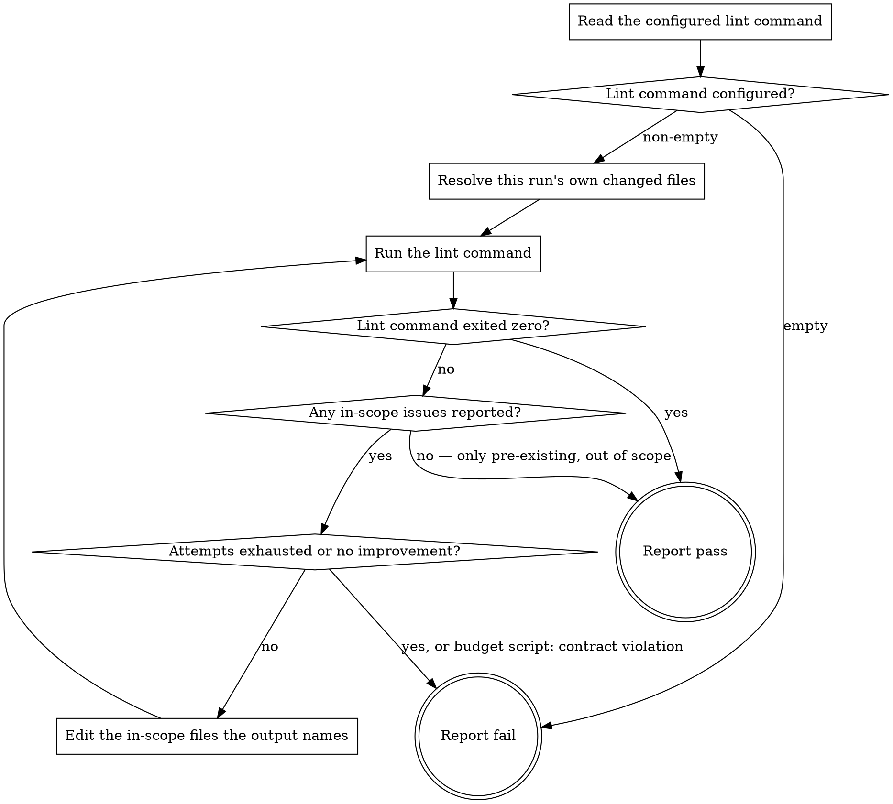

# eds-lint

This stage always runs. It has no `tracker`/`scm`/`design`/`browser` role dependency — it runs the
project's configured lint command against this checkout and, if that command fails, edits the
files it names and tries again, before giving up and reporting what remains.

The loop follows `../../../agentic-core/shared/fix-loop.md`. A **check** is one run of the lint
command; an **edit** is one pass through **Edit the in-scope files the output names**. Keep a count,
`edits-made`, starting at `0` and raised by one after each edit, never after a run. The budget is
this stage's `fix_attempts` in the pack manifest; this file never states it, and the stage never
compares the count against it itself.

Read `../../../agentic-core/shared/project-config.md` for the shape referenced in **Read the
configured lint command**, `../../../agentic-core/shared/fix-loop.md` for the loop's unit, `../../../agentic-core/shared/publish-criteria.md`'s "The change,
minimally" section for how this stage resolves the same merge-base diff `publish-gate` reviews
later, and `../../../agentic-core/shared/result-envelope.md` for the `## Result` block this stage
must end with.

## Input

None directly. This stage reads `.ai/project-config.yaml`'s `commands.lint` at its fixed path —
one whole-project command, not scoped to any particular file or block, so its own output routinely
names files nothing in this run touched: pre-existing issues elsewhere in the project. This stage
does not receive a file list from `implement` directly — the runner never forwards one stage's
artifacts to another (`stage-runner.md`) — but it does resolve, itself, the same merge-base diff
`publish-gate` reviews later (**Resolve this run's own changed files**, below), so it can tell its
own change's issues apart from the project's pre-existing debt without waiting for `publish-gate`
to be the one to notice.

## Flow



## Node Details

### Read the configured lint command

Read `.ai/project-config.yaml`'s `commands.lint` value.

### Lint command configured?

Non-empty — continue to **Resolve this run's own changed files**. Empty string — go to
**Report fail**: this is a configuration gap pre-flight should already have caught, and this stage
has nothing to run without it.

### Resolve this run's own changed files

Resolve the project root's changed-file set exactly the way `publish-criteria.md`'s "The change,
minimally" section defines it — the same diff `publish-gate` reviews later, computed here first so
this stage's own edits never grow it:

```
BASE=$(git symbolic-ref refs/remotes/origin/HEAD)
MERGE_BASE=$(git merge-base "${BASE#refs/remotes/}" HEAD)
git diff "$MERGE_BASE" --name-only
git ls-files --others --exclude-standard
```

**Both commands, unioned.** The second is not an extra precaution — without it this stage is at
its blindest on exactly the work most likely to carry a lint violation. `git diff` reports changes
to paths git already tracks, so a component created during this run and never committed appears in
no diff, its violations read as out of scope, and this stage reports pass on a file set that
excluded the entire change. A new block is untracked in its entirety until its first commit.

Record this file list — call it the in-scope set for the rest of this stage. It is resolved once,
before the first run, and does not change between runs: every file this stage itself might go on to
edit is a file the lint command's own output names, and every such edit only ever happens inside
this set (see **Edit the in-scope files the output names**, below) — nothing this stage does can add
a new file to it. `edits-made` is `0` — continue to **Run the lint command**.

### Run the lint command

Run the configured command exactly as written. Record its exit code and its combined output
(stdout and stderr) in full — this run's output, kept only long enough to compare against the
next run's, and to write into the report if this stage ends in **Report fail**.

### Lint command exited zero?

A zero exit — continue to **Report pass**, regardless of what the command printed: a lint command
may print warnings on a run it still considers passing, and the exit code is the signal its own
configuration already uses to mean pass or fail, not the presence of any output. A non-zero exit —
continue to **Any in-scope issues reported?**.

### Any in-scope issues reported?

Read this run's output and identify the files it reports issues in. Any of those files appear
in the in-scope set resolved earlier — continue to **Attempts exhausted or no improvement?**. None
of them do (every reported file is outside the in-scope set) — go to **Report pass**: every
remaining issue predates this run's own change and belongs to no step in `plan.yaml`, the same test
`publish-gate` will apply to this stage's own edits later. Forcing this stage to either fail over
debt it has no standing to fix, or fix it anyway and hand `publish-gate` a diff wider than the plan,
would both be worse than reporting the project's pre-existing lint state plainly and moving on —
**Report pass**, below, names what was left alone rather than silently treating it as clean.

### Attempts exhausted or no improvement?

Answer two questions, in this order.

1. **Is the budget spent?** Run:

   ```
   bash ${CLAUDE_PLUGIN_ROOT}/../agentic-core/shared/lib/check-fix-budget.sh \
     ${CLAUDE_PLUGIN_ROOT}/pack.yaml .ai/project-config.yaml lint <edits-made>
   ```

   - Exit `4`, `decision: exhausted` — go to **Report fail**. This run's findings are the last ones;
     no edit follows them.
   - Exit `1`, `decision: terminate-contract-violation` — go to **Report fail**, naming the script's
     `invalid:` line verbatim.
   - Exit `0`, `decision: edit` — the budget allows another edit; answer question 2.

2. **Did the last edit improve anything?** Only when `edits-made` is at least `1`: this run's
   combined output is identical to the run before it — nothing changed, so another edit would only
   repeat it. Go to **Report fail**. This is this stage's own judgment, never the script's.

Budget left and (on the first run) nothing to compare against, or a changed output — continue to
**Edit the in-scope files the output names**.

### Edit the in-scope files the output names

Read this run's output and, from it alone, identify the files and issues it reports. Edit only
the files that are both named by the output and present in the in-scope set resolved earlier —
nothing else: no file the output did not name, and no file outside this run's own change even when
the output names it (that file's issues are pre-existing debt, handled by **Any in-scope issues
reported?** above, not by editing it). Fix every in-scope issue the output names in this one edit,
each at its cause (`fix-loop.md`) — one rule's violation repeated across a file is one cause. Raise
`edits-made` by one, then return to **Run the lint command** for the next run.

### Report fail

Emit the `## Result` block as plain `key: value` lines per `../../../agentic-core/shared/result-envelope.md` — never as a bulleted or backtick-wrapped list, with `verdict:` as the very next line, nothing between it and the heading, and never followed by anything else — not even a summary explicitly labeled as commentary or "not part of the envelope"; if that's worth writing, put it before the heading instead, where it is already sanctioned. Fields:

- `verdict: fail`
- `summary`: one sentence, 200 characters or fewer (the envelope's hard cap — an oversized summary fails validation and takes the whole run to `failed`) — either that no lint command is configured, or that the lint edit budget was
  exhausted (naming `edits-made`) or stopped for lack of improvement, plus how many issues
  remain per the last run. Never the command's raw output verbatim.
- `artifacts` (always a YAML list — `artifacts:` then `  - <path>` per line; even a single path is a list, never an inline scalar): empty when no lint command was configured. Otherwise, every file edited across all
  edits, plus `.ai/run-context/lint-report.md` — written with the last run's full combined output,
  `edits-made`, the number of runs, and which answer of **Attempts exhausted or no improvement?**
  ended the loop.
- `next_action: none`

### Report pass

Reached from **Any in-scope issues reported?** (every remaining issue out of scope) rather than
from a literal zero exit — write `.ai/run-context/lint-report.md` first, naming exactly which
files/issues remain and that each is outside the in-scope set resolved earlier, i.e. pre-existing
and not introduced or touched by this run. Never omitted and never folded silently into a clean
pass, the same convention other stages use for their own downgrade cases.

Emit the `## Result` block as plain `key: value` lines per `../../../agentic-core/shared/result-envelope.md` — never as a bulleted or backtick-wrapped list, with `verdict:` as the very next line, nothing between it and the heading, and never followed by anything else — not even a summary explicitly labeled as commentary or "not part of the envelope"; if that's worth writing, put it before the heading instead, where it is already sanctioned. Fields:

- `verdict: pass`
- `summary`: one sentence, 200 characters or fewer (the envelope's hard cap — an oversized summary fails validation and takes the whole run to `failed`) naming how many runs it took to exit
  zero, or, when reached with pre-existing issues left in place, how many remain and that they are
  out of scope.
- `artifacts` (always a YAML list — `artifacts:` then `  - <path>` per line; even a single path is a list, never an inline scalar): every file edited across any earlier edits, plus `.ai/run-context/lint-report.md`
  when reached with pre-existing issues left in place — both empty if it passed on the first
  run with nothing to report.
- `next_action: none`
