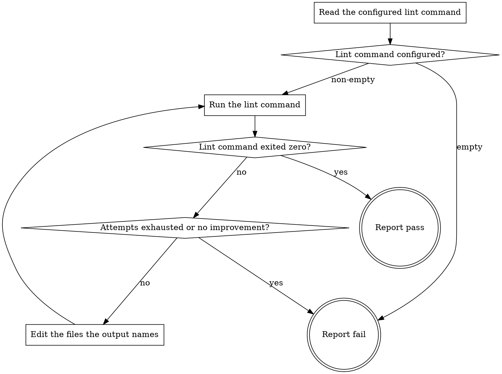

# eds-lint

This stage always runs. It has no `tracker`/`scm`/`design`/`browser` role dependency — it runs the
project's configured lint command against this checkout and, if that command fails, edits the
files it names and tries again, up to three attempts before giving up and reporting what remains.

Read `../../../agentic-core/shared/project-config.md` for the shape referenced in **Read the
configured lint command**, and `../../../agentic-core/shared/result-envelope.md` for the `##
Result` block this stage must end with.

## Input

None. This stage reads `.ai/project-config.yaml`'s `commands.lint` at its fixed path — one
whole-project command, not scoped to any particular file or block. It does not receive a file list
from `implement` or `verify` directly — the runner never forwards one stage's artifacts to another
(`stage-runner.md`); this stage's own scope is exactly whatever the configured command already
covers.

## Flow

## Node Details

### Read the configured lint command

Read `.ai/project-config.yaml`'s `commands.lint` value.

### Lint command configured?

Non-empty — continue to **Run the lint command**; this is attempt 1. Empty string — go to
**Report fail**: this is a configuration gap pre-flight should already have caught, and this stage
has nothing to run without it.

### Run the lint command

Run the configured command exactly as written. Record its exit code and its combined output
(stdout and stderr) in full — this attempt's output, kept only long enough to compare against the
next attempt's, and to write into the report if this stage ends in **Report fail**.

### Lint command exited zero?

A zero exit — continue to **Report pass**, regardless of what the command printed: a lint command
may print warnings on a run it still considers passing, and the exit code is the signal its own
configuration already uses to mean pass or fail, not the presence of any output. A non-zero exit —
continue to **Attempts exhausted or no improvement?**.

### Attempts exhausted or no improvement?

Either of the following — go to **Report fail**:

- This was the third run of the command.
- This run's combined output is identical to the immediately preceding run's — nothing changed, so
  another attempt would only repeat it.

Neither — continue to **Edit the files the output names**.

### Edit the files the output names

Read this attempt's output and, from it alone, identify the files and issues it reports. Edit
exactly those files to resolve what is reported — nothing else, and no file the output did not
name. Then return to **Run the lint command** for the next attempt.

### Report fail

Emit the `## Result` block:

- `verdict: fail`
- `summary`: one sentence — either that no lint command is configured, or that lint attempts were
  exhausted (naming the attempt count) or stopped for lack of improvement, plus how many issues
  remain per the last run. Never the command's raw output verbatim.
- `artifacts`: empty when no lint command was configured. Otherwise, every file edited across all
  attempts, plus `.ai/run-context/lint-report.md` — written with the last attempt's full combined
  output, the attempt count, and which of the two stop conditions above applied.
- `next_action: none`

### Report pass

Emit the `## Result` block:

- `verdict: pass`
- `summary`: one sentence naming how many attempts the lint command took to exit zero.
- `artifacts`: every file edited across any earlier attempts — empty if it passed on the first
  attempt.
- `next_action: none`
