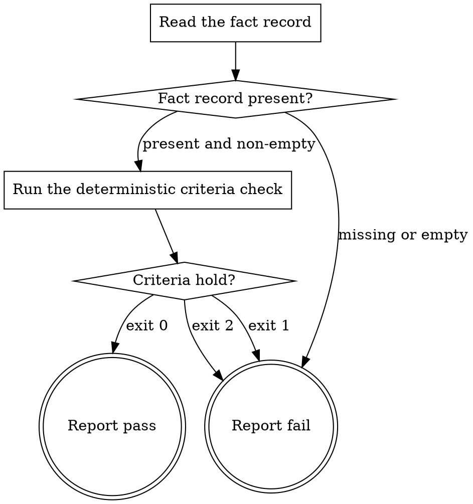

# eds-readiness

This stage always runs. It has no `tracker`/`scm`/`design`/`browser` role dependency — it reads the
fact record a prior stage wrote and this pack's own manifest.

Read `../../../agentic-core/shared/readiness-criteria.md` for the criteria this stage checks and
why this gate carries no reviewing-model half, `../../../agentic-core/shared/fact-record.md` for
the record's shape, and `../../../agentic-core/shared/result-envelope.md` for the `## Result` block
this stage must end with.

## Input

None. This stage reads `.ai/run-context/fact-record.yaml` at its fixed path — the artifact `intake`
always writes — and `${CLAUDE_PLUGIN_ROOT}/pack.yaml`, this platform pack's own manifest.

**This stage writes nothing, anywhere.** It produces no artifact, and the pack manifest declares
none for it. Its whole output is the verdict in its `## Result` block. Unlike `plan-gate` and
`publish-gate`, this stage does not run in an isolated worktree: it never reads project source,
never reads a diff, and never reads anything outside `.ai/run-context/fact-record.yaml` and its own
plugin's manifest, both of which are identical whether read from this checkout or any other. There
is nothing here an isolated checkout would protect.

## Flow



## Node Details

### Read the fact record

Read `.ai/run-context/fact-record.yaml`.

### Fact record present?

The file exists and is non-empty — go to **Run the deterministic criteria check**. Missing or
empty — go to **Report fail**: `intake` should have written it, and this gate cannot answer
readiness for an item it has no facts about. Do not substitute a fact record of your own; producing
that artifact is `intake`'s job, and this gate reads it, never recomputes it.

### Run the deterministic criteria check

Run:

```
bash ${CLAUDE_PLUGIN_ROOT}/../agentic-core/shared/lib/check-readiness-criteria.sh \
  ${CLAUDE_PLUGIN_ROOT}/pack.yaml \
  .ai/run-context/fact-record.yaml
```

Record its exit code and its stderr. This is the entire gate — every criterion it states is
answerable by comparing the fact record against the pack manifest, so there is no reviewing model
after it (`readiness-criteria.md`).

### Criteria hold?

- Exit `0` — every criterion holds. Go to **Report pass**.
- Exit `1` — a criterion fails, and stderr names the undeclared item_type or the exact field that
  did not hold. Go to **Report fail**.
- Exit `2` — a usage error: the check did not run to a verdict at all (no usable `item_type` in the
  fact record, or the pack manifest has no `readiness_criteria:` key). Go to **Report fail**. This
  is not the same failure as exit `1` and must not be reported as one; a check that could not decide
  has told you nothing about the item, and treating "did not run" as "passed" is how a gate becomes
  decorative.

### Report fail

Emit the `## Result` block:

- `verdict: fail`
- `summary`: one sentence — the missing-fact-record reason; or the checker's `invalid: <reason>`
  from stderr, verbatim, never reworded into something more general; or that the checker could not
  run to a verdict, naming its usage error.
- `artifacts: []` — this stage writes nothing.
- `next_action: none`

### Report pass

Emit the `## Result` block:

- `verdict: pass`
- `summary`: one sentence naming the item's `item_type` and that its declared readiness criteria
  all hold.
- `artifacts: []`
- `next_action: none`

## Known limitation

This adapter answers `readiness-criteria.md`'s criteria 1–3 only. It never returns
`verdict: question` for an item whose only design source is an ambiguous image attachment (core
contract §6.1, gap G36) — the fact record does not carry enough to tell an image-only source from a
URL-backed one, and this gate is forbidden from re-reading the raw item to recover that distinction.
See `readiness-criteria.md`'s own "Known limitation" section and the gap register entry it
references.
