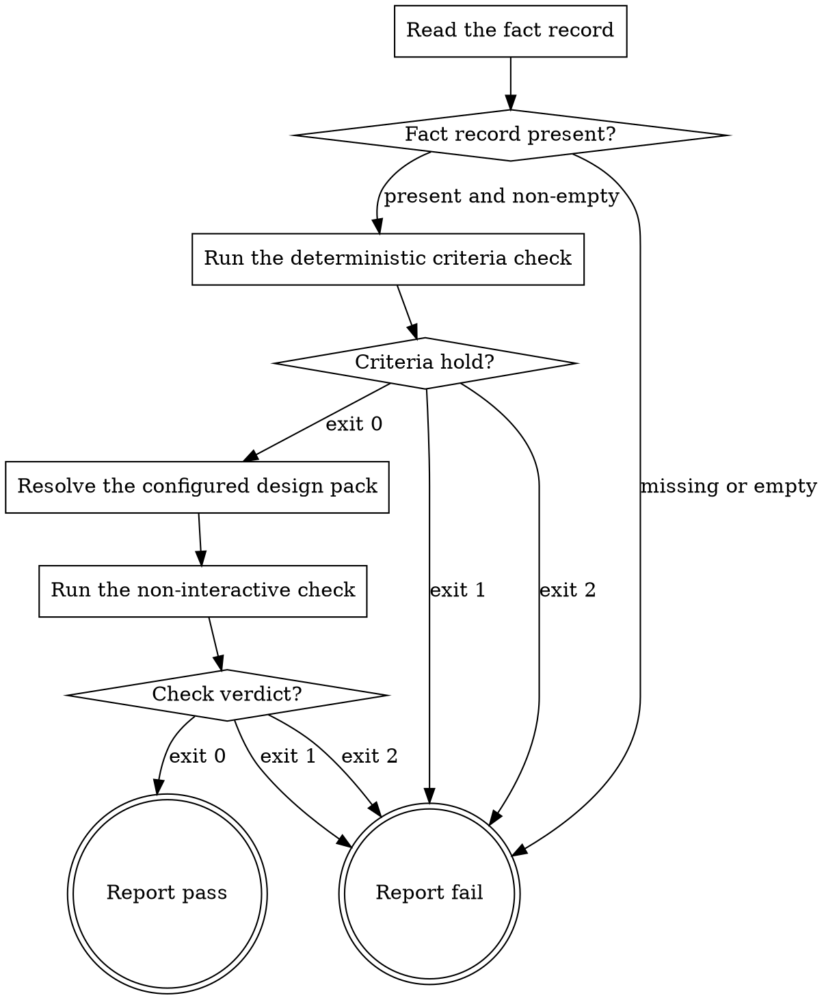

# eds-readiness

This stage always runs. It has no `tracker`/`scm`/`design`/`browser` role dependency — it never
resolves or calls a provider pack. It reads the fact record a prior stage wrote, this pack's own
manifest, run state, project config, and — by path only, as a manifest file — the configured design
pack's own manifest (D100).

Read `../../../agentic-core/shared/readiness-criteria.md` for the criteria this stage checks and
why this gate carries no reviewing-model half, `../../../agentic-core/shared/fact-record.md` for
the record's shape, and `../../../agentic-core/shared/result-envelope.md` for the `## Result` block
this stage must end with.

## Input

None. This stage reads `.ai/run-context/fact-record.yaml` at its fixed path — the artifact `intake`
always writes — `${CLAUDE_PLUGIN_ROOT}/pack.yaml`, this platform pack's own manifest, `.ai/run-state.json`
(`shared/run-state.md`), `.ai/project-config.yaml`'s `packs.design` value, and, when that value names
a pack, `${CLAUDE_PLUGIN_ROOT}/../<packs.design>/pack.yaml` — the same sibling-directory convention
`eds-intake`'s own "Resolve the tracker pack" step already uses.

**This stage writes nothing, anywhere.** It produces no artifact, and the pack manifest declares
none for it. Its whole output is the verdict in its `## Result` block. Unlike `plan-gate` and
`publish-gate`, this stage does not run in an isolated worktree: it never reads project source,
never reads a diff, and reads nothing outside the fixed-path files named above — the fact record,
run state, project config, this pack's own manifest and (by path only) another pack's manifest —
every one of which is identical whether read from this checkout or any other. There is nothing here
an isolated checkout would protect.

## Flow


```dot
digraph eds_readiness {
    "Read the fact record" [shape=box];
    "Fact record present?" [shape=diamond];
    "Run the deterministic criteria check" [shape=box];
    "Criteria hold?" [shape=diamond];
    "Resolve the configured design pack" [shape=box];
    "Run the non-interactive check" [shape=box];
    "Check verdict?" [shape=diamond];
    "Report fail" [shape=doublecircle];
    "Report pass" [shape=doublecircle];

    "Read the fact record" -> "Fact record present?";
    "Fact record present?" -> "Run the deterministic criteria check" [label="present and non-empty"];
    "Fact record present?" -> "Report fail" [label="missing or empty"];
    "Run the deterministic criteria check" -> "Criteria hold?";
    "Criteria hold?" -> "Resolve the configured design pack" [label="exit 0"];
    "Criteria hold?" -> "Report fail" [label="exit 1"];
    "Criteria hold?" -> "Report fail" [label="exit 2"];
    "Resolve the configured design pack" -> "Run the non-interactive check";
    "Run the non-interactive check" -> "Check verdict?";
    "Check verdict?" -> "Report pass" [label="exit 0"];
    "Check verdict?" -> "Report fail" [label="exit 1"];
    "Check verdict?" -> "Report fail" [label="exit 2"];
}
```

## Node Details

### Read the fact record

Read `.ai/run-context/fact-record.yaml`.

### Fact record present?

The file exists and is non-empty — go to **Run the deterministic criteria check**. Missing or
empty — go to **Report fail**: `intake` should have written it, and this gate cannot answer
readiness for an item it has no facts about. Do not substitute a fact record of your own; producing
that artifact is `intake`'s job, and this gate reads it, never recomputes it.

### Run the deterministic criteria check

Run:

```
bash ${CLAUDE_PLUGIN_ROOT}/../agentic-core/shared/lib/check-readiness-criteria.sh \
  ${CLAUDE_PLUGIN_ROOT}/pack.yaml \
  .ai/run-context/fact-record.yaml
```

Record its exit code and its stderr. This is the entire gate — every criterion it states is
answerable by comparing the fact record against the pack manifest, so there is no reviewing model
after it (`readiness-criteria.md`).

### Criteria hold?

- Exit `0` — every criterion holds. Go to **Resolve the configured design pack**.
- Exit `1` — a criterion fails, and stderr names the undeclared item_type or the exact field that
  did not hold. Go to **Report fail**.
- Exit `2` — a usage error: the check did not run to a verdict at all (no usable `item_type` in the
  fact record, or the pack manifest has no `readiness_criteria:` key). Go to **Report fail**. This
  is not the same failure as exit `1` and must not be reported as one; a check that could not decide
  has told you nothing about the item, and treating "did not run" as "passed" is how a gate becomes
  decorative.

### Resolve the configured design pack

Read `.ai/project-config.yaml`'s `packs.design` value. Absent or the literal `none` — the third
argument to **Run the non-interactive check** below is the literal string `none`. Otherwise it is
`${CLAUDE_PLUGIN_ROOT}/../<packs.design>/pack.yaml` — the same "installed pack = sibling directory
of the plugin root" convention `eds-intake`'s own "Resolve the tracker pack" step uses. Do not check
this path exists yourself; the script below reports that as its own usage error if it does not.

### Run the non-interactive check

Run:

```
bash ${CLAUDE_PLUGIN_ROOT}/../agentic-core/shared/lib/check-non-interactive-readiness.sh \
  .ai/run-context/fact-record.yaml \
  .ai/run-state.json \
  <design-pack.yaml-path-or-none>
```

D100, G503. Reads `design_source_kind` (written by `intake`, `fact-record.md`) and `mode`
(`run-state.md`) from files this gate already trusts, and the resolved design pack's manifest —
never a live call to the design role, never OAuth, never anything that would give this gate the
`design` role dependency its own description says it does not have.

### Check verdict?

- Exit `0` — proceed: not a `url` source, not `autonomous` mode, no design pack configured, or the
  configured pack does not declare `fetch_reference` under `requires_interactive_session`. Go to
  **Report pass**.
- Exit `1` — refuse: a `url`-sourced item, `autonomous` mode, and the configured design pack
  declares it cannot complete `fetch_reference` without an interactive session. Stdout names the
  item id and the reason. Go to **Report fail**.
- Exit `2` — a usage error (a file this stage itself should have supplied could not be read). Go to
  **Report fail**, naming the error — not the same failure as exit `1` and must not be reported as
  one, for the same reason **Criteria hold?**'s own exit `2` is not.

### Report fail

Emit the `## Result` block as plain `key: value` lines per `../../../agentic-core/shared/result-envelope.md` — never as a bulleted or backtick-wrapped list, with `verdict:` as the very next line, nothing between it and the heading, and never followed by anything else — not even a summary explicitly labeled as commentary or "not part of the envelope"; if that's worth writing, put it before the heading instead, where it is already sanctioned. Fields:

- `verdict: fail`
- `summary`: one sentence, 200 characters or fewer (the envelope's hard cap — an oversized summary fails validation and takes the whole run to `failed`) — the missing-fact-record reason; the criteria checker's `invalid: <reason>`
  from stderr, verbatim, never reworded into something more general; the non-interactive check's own
  `refuse: <reason>` line, verbatim, when that is what fired; or that a checker could not run to a
  verdict, naming its usage error.
- `artifacts: []` — this stage writes nothing.
- `next_action: none`

### Report pass

Emit the `## Result` block as plain `key: value` lines per `../../../agentic-core/shared/result-envelope.md` — never as a bulleted or backtick-wrapped list, with `verdict:` as the very next line, nothing between it and the heading, and never followed by anything else — not even a summary explicitly labeled as commentary or "not part of the envelope"; if that's worth writing, put it before the heading instead, where it is already sanctioned. Fields:

- `verdict: pass`
- `summary`: one sentence, 200 characters or fewer (the envelope's hard cap — an oversized summary fails validation and takes the whole run to `failed`) naming the item's `item_type` and that its declared readiness criteria
  all hold.
- `artifacts: []`
- `next_action: none`

## Known limitation

This adapter answers `readiness-criteria.md`'s criteria 1–3 only. It never returns
`verdict: question` for an item whose only design source is an ambiguous image attachment (core
contract §6.1, gap G36). **Distinguishing a URL-backed source from an image-only one is no longer
part of this limitation** — `design_source_kind` (`fact-record.md`, D100, G503) now carries that
distinction, written by `intake`, so this gate reads it from the fact record rather than re-reading
the raw item; the "forbidden from re-reading the raw item" rule stands unchanged, it is simply no
longer the obstacle here. What G36 still names is narrower and still open: when more than one image
is attached and irreducibly ambiguous which is the reference, this gate has no way to ask a human
which one — it can refuse the whole item (readiness criteria) but not pose that specific question.
See `readiness-criteria.md`'s own "Known limitation" section and the gap register entry it
references.
