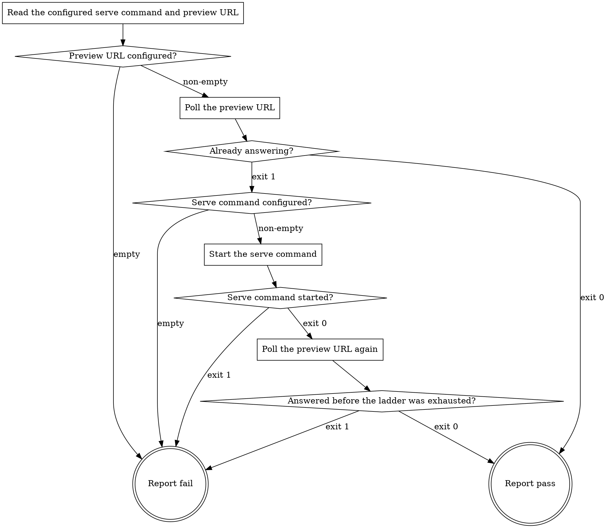

# eds-serve

This stage always runs. It has no `tracker`/`scm`/`design`/`browser` role dependency — it reads
the project's own configured serve command and preview URL, and its whole job is that something is
answering at that URL by the time it returns.

Read `../../../agentic-core/shared/project-config.md` for the shape referenced in **Read the
configured serve command and preview URL**, and `../../../agentic-core/shared/result-envelope.md`
for the `## Result` block this stage must end with.

## Input

None. This stage reads `.ai/project-config.yaml`'s `commands.serve` and `paths.preview` at their
fixed path. It receives nothing from any earlier stage, and nothing it does depends on what the
work item says — which is why it carries no `when:` and runs on every item.

## Poll before starting, never the other way round

The first thing this stage does is poll. A server may already be answering — left by an earlier
run of this same stage, or started by a human — and starting a second one against a bound port
produces a process that dies on startup while the poll still succeeds against the first. The
stage would then report success for a server it did not start and write a log nobody reads. Poll
first, and that case resolves into what it actually is: already up, nothing to do.

## What this stage leaves behind, and what nothing cleans up

A server started here outlives this stage. It has to: this stage runs in its own isolated
subagent, and every later stage that renders a page runs in a different one, so a server bound to
the lifetime of its starter would be gone before the first consumer asked for a page.

**The stage vocabulary has no teardown stage.** Nothing in a route stops what this stage started,
so the process survives the run and every run after it until a human ends it. The report this
stage writes is therefore not a convenience — it is the only record of a process the run leaves
running, and the process id in it is the only handle anyone gets.

## Flow



## Node Details

### Read the configured serve command and preview URL

Read `.ai/project-config.yaml`'s `commands.serve` and `paths.preview` values.

### Preview URL configured?

Non-empty — continue to **Poll the preview URL**. Empty — go to **Report fail**: this stage's
whole verdict is whether something answers at that URL, and with no URL there is no question to
answer. Do not substitute a URL of your own, and do not fall back to the serve command's own
output for one; the project declares where its preview lives, and a URL guessed here would be
handed onward to every stage that renders a page.

### Poll the preview URL

Run:

```
bash ${CLAUDE_PLUGIN_ROOT}/skills/eds-serve/scripts/poll-preview.sh <the preview URL>
```

Record its exit code and its output. On exit `0` its stdout names the HTTP status that answered,
which poll answered, and how long that took.

**Any HTTP status counts as an answer, a 4xx or 5xx included.** The question this stage settles is
whether the origin is bound, not whether that one path exists — a preview path is configuration
and may name something the project does not serve, while every stage that renders a page builds
its own URL from the same origin. A poll that requires a particular status would fail forever on a
project whose configured path is not a served one, and would be reporting on the path rather than
on the server.

### Already answering?

- Exit `0` — something is already answering. Go to **Report pass**. Nothing is started, and the
  report records that this stage did not start what is running.
- Exit `1` — nothing answered. Continue to **Serve command configured?**.

### Serve command configured?

Non-empty — continue to **Start the serve command**. Empty — go to **Report fail**: nothing is
answering and the project declares no command that would make it answer. This is a configuration
gap pre-flight should already have caught, not a transient failure, and it will not resolve by
waiting.

### Start the serve command

Run:

```
bash ${CLAUDE_PLUGIN_ROOT}/skills/eds-serve/scripts/start-serve.sh \
  <the serve command> \
  .ai/run-context/serve.log \
  .ai/run-context/serve.pid
```

Record its exit code and its output. On exit `0` its stdout names the process id that stops the
server again; on exit `1` its stderr names why the command could not be started and carries the
first lines of the command's own output.

### Serve command started?

- Exit `0` — the command started and was still running a moment later. Continue to **Poll the
  preview URL again**.
- Exit `1` — the command could not be started, or exited immediately. Go to **Report fail**. Do
  not poll after this and do not retry the start: a command that exited on startup will exit the
  same way again, and waiting out the poll ladder would replace a failure that names itself with
  one that reports only an absence.

### Poll the preview URL again

Run the same poll as **Poll the preview URL**, against the same URL, now that the serve command is
running. Record its exit code and its output. This poll is where the wait for a starting server
actually happens; the ladder inside the script is this stage's whole transient-failure budget, and
this stage adds no retry of its own around it.

### Answered before the ladder was exhausted?

- Exit `0` — the server came up. Go to **Report pass**.
- Exit `1` — the ladder was exhausted with nothing answering. Go to **Report fail**. The process
  was started and may still be running, so the report still records its process id and log — a
  server that is running but not answering is exactly the case a human needs the log for.

### Report fail

Write `.ai/run-context/serve-report.md` unless this stage reached here from **Preview URL
configured?** or **Serve command configured?** — in both of those nothing was polled and nothing
was started, so there is nothing to report on. The report carries, one field per line: the URL
polled; the status that answered, or `none`; whether this stage started what is running; the
process id, or `none`; the log path, or `none`; and the poll output that ended the attempt.

Then emit the `## Result` block:

- `verdict: fail`
- `summary`: one sentence — either that no preview URL is configured; or that nothing answered and
  no serve command is configured; or that the serve command exited on startup; or that the preview
  never answered before the poll ladder was exhausted, naming that this last one is a transient
  failure. Never the serve command's raw output verbatim.
- `artifacts`: empty for the two configuration gaps. Otherwise `.ai/run-context/serve-report.md`,
  plus `.ai/run-context/serve.log` when a command was started.
- `next_action: none`

### Report pass

Write `.ai/run-context/serve-report.md` with the same fields as **Report fail**. When this stage
reached here from **Already answering?**, the started-by-this-stage field is false and the process
id and log are `none` — this stage has no handle on a server it did not start, and recording one
it guessed at would be worse than recording none.

Then emit the `## Result` block:

- `verdict: pass`
- `summary`: one sentence naming the answering status and whether this stage started the server or
  found it already answering.
- `artifacts`: `.ai/run-context/serve-report.md`, plus `.ai/run-context/serve.log` when a command
  was started.
- `next_action: none`
