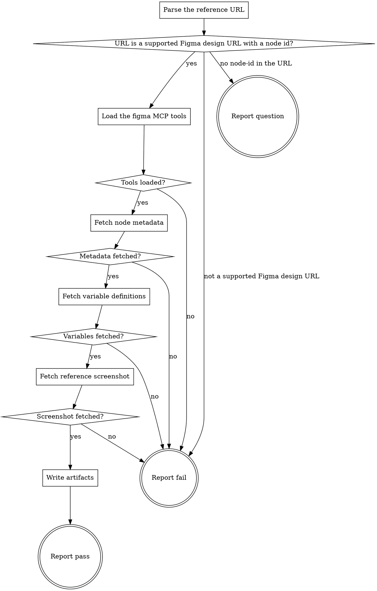

# fetch-reference

Implements the `design` role's `fetch_reference` operation: retrieve a Figma node's design
values and a reference screenshot from a real Figma file, through the already-installed `figma`
marketplace plugin's MCP server (`mcp__plugin_figma_figma__*`).

This operation deliberately never calls `get_design_context` or loads the `figma-design-to-code`
skill. Those exist for a different job — generating application code from a design — and bring a
mandatory code-generation workflow this operation has no use for. `get_metadata`,
`get_variable_defs` and `get_screenshot` cover design values and a reference image on their own,
with no such prerequisite.

## Input

One line in the invocation argument:

```
reference: <a figma.com design URL, including a node-id>
```

## Flow



## Node Details

### Parse the reference URL

Take the `reference` value from the input above. Extract:

- **`file_key`** — the path segment right after `/design/`. If the URL instead has the shape
  `.../design/<file_key>/branch/<branch_key>/<file_name>`, use `branch_key` as the `file_key`
  instead (the file key of that branch).
- **`node_id`** — the `node-id` query parameter, exactly as written (e.g. `1-1043`). Every
  `mcp__plugin_figma_figma__*` tool used below accepts a node id in this hyphen form directly, so
  do not convert it.

### URL is a supported Figma design URL with a node id?

- The URL's host is `figma.com` or `www.figma.com` and its path contains `/design/` — otherwise go
  to **Report fail** (`/file/`, `/board/`, `/slides/` and `/make/` URLs are not supported by this
  operation).
- The URL has a `node-id` query parameter — otherwise go to **Report question**: a file-only URL
  does not name which frame or node is the reference.
- Both hold — continue to **Load the figma MCP tools**.

### Load the figma MCP tools

Run `ToolSearch` with `query: "select:mcp__plugin_figma_figma__get_metadata,mcp__plugin_figma_figma__get_variable_defs,mcp__plugin_figma_figma__get_screenshot"`.

### Tools loaded?

All three tools resolved to full schemas — continue to **Fetch node metadata**. Any of them still
unresolved means the `figma` plugin is not installed, or is installed but has not completed its
OAuth flow in this session (an unauthenticated connection only exposes `authenticate` and
`complete_authentication`, never the tools above) — go to **Report fail**, naming that the `figma`
plugin must be installed and authenticated before this operation can run.

### Fetch node metadata

Call `mcp__plugin_figma_figma__get_metadata` with the parsed `file_key` and `node_id`. This
confirms the node exists and returns its name and geometry (`x`, `y`, `width`, `height`) as XML
attributes on the matching element.

### Metadata fetched?

The call returned the node's XML element — continue to **Fetch variable definitions**. The call
errored (file or node not found, no access, or any other tool error) — go to **Report fail**,
naming the error exactly as returned, never guessed or reworded into something more general.

### Fetch variable definitions

Call `mcp__plugin_figma_figma__get_variable_defs` with the same `file_key` and `node_id`. It
returns a flat map of variable name to value (colors, spacing, or any other token the node uses).
An **empty** map is a normal, successful result — most nodes use no variables at all — and is not
itself a reason to go to **Report fail**.

### Variables fetched?

The call returned (even an empty map) — continue to **Fetch reference screenshot**. The call
errored — go to **Report fail**, naming the error exactly as returned.

### Fetch reference screenshot

Call `mcp__plugin_figma_figma__get_screenshot` with the same `file_key` and `node_id`. It returns
a short-lived `image_url` plus `width`/`height`. That URL is treated like a secret, per the tool's
own description — never write it into the envelope, a log, or any other file; it exists only long
enough for the next step's download.

### Screenshot fetched?

The call returned an `image_url` — continue to **Write artifacts**. The call errored — go to
**Report fail**, naming the error exactly as returned.

### Write artifacts

1. Ensure `.ai/figma/` exists at the project root (`mkdir -p .ai/figma`).
2. Download the screenshot immediately, before doing anything else, to
   `.ai/figma/<file_key>-<node_id>.png` — e.g. `curl -sS -L -o ".ai/figma/<file_key>-<node_id>.png" "<image_url>"`.
3. Write `.ai/figma/<file_key>-<node_id>.json`, an object with: `reference` (the original input
   URL), `file_key`, `node_id`, `node_name` (from the metadata step), `geometry` (the `x`/`y`/
   `width`/`height` from the metadata step), and `variables` (the map from the variable-defs step,
   verbatim — including an empty object when it was empty).
4. Continue to **Report pass**.

### Report pass

Emit the `## Result` block (`../../../agentic-core/shared/result-envelope.md`):

- `verdict: pass`
- `summary`: one sentence naming the node and the Figma file the reference came from.
- `artifacts`: both files written above, `.ai/figma/<file_key>-<node_id>.json` and
  `.ai/figma/<file_key>-<node_id>.png`.
- `next_action: none`
- `metrics: variables=<count of entries in the variable map>`

### Report fail

Emit the `## Result` block (`../../../agentic-core/shared/result-envelope.md`):

- `verdict: fail`
- `summary`: one sentence naming what went wrong — the unsupported URL shape, the missing/
  unauthenticated `figma` plugin, or the tool error that was returned. Never a guess at the cause.
- `artifacts: []`
- `next_action: none`

### Report question

Emit the `## Result` block (`../../../agentic-core/shared/result-envelope.md`):

- `verdict: question`
- `summary`: one sentence — the given URL has no node-id.
- `artifacts: []`
- `next_action: none`
- `question`: ask which frame or node in the file should be the design reference.
- `blocker`: the reference URL has no `node-id`.
