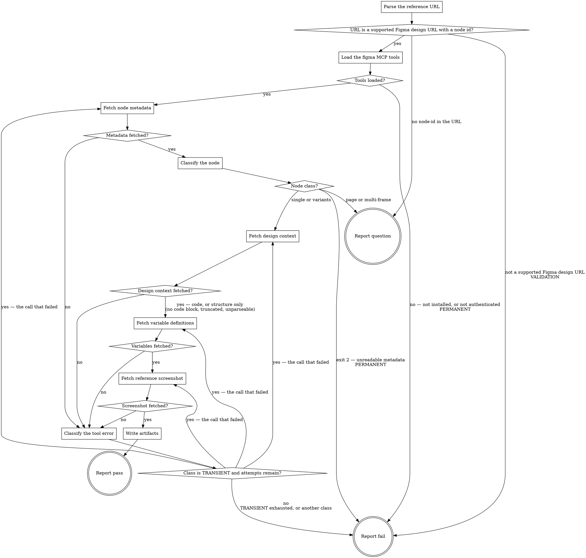

# fetch-reference

Implements the `design` role's `fetch_reference` operation: retrieve a Figma node's design
values and a reference screenshot from a real Figma file, through the already-installed `figma`
marketplace plugin's MCP server (`mcp__plugin_figma_figma__*`).

## Tools

| Tool | Returns | Role in this operation |
| --- | --- | --- |
| `get_design_context` | Reference code whose classes carry layout (direction, alignment, gap, padding, size), colour, radius and typography (family, size, weight, line height, letter spacing), plus a line naming the styles and variables the node uses | **Default source** for layout, colour and typography |
| `get_variable_defs` | Flat map of variable name → value | Token names for the values above |
| `get_metadata` | Node name and geometry (`x`, `y`, `width`, `height`) as XML | Confirms the node exists; exact geometry; whether the node is one frame, viewport variants, or several frames |
| `get_screenshot` | Short-lived PNG URL with `width`/`height` | Reference image |

`get_design_context` requires the `figma-design-to-code` skill to be loaded first. Load it for that
prerequisite only: this operation writes no application code, so that skill's implementation and
verification steps do not apply here.

## Input

One line in the invocation argument:

```
reference: <a figma.com design URL, including a node-id>
```

## Flow


```dot
digraph fetch_reference {
    "Parse the reference URL" [shape=box];
    "URL is a supported Figma design URL with a node id?" [shape=diamond];
    "Load the figma MCP tools" [shape=box];
    "Tools loaded?" [shape=diamond];
    "Fetch node metadata" [shape=box];
    "Metadata fetched?" [shape=diamond];
    "Classify the node" [shape=box];
    "Node class?" [shape=diamond];
    "Fetch design context" [shape=box];
    "Design context fetched?" [shape=diamond];
    "Fetch variable definitions" [shape=box];
    "Variables fetched?" [shape=diamond];
    "Fetch reference screenshot" [shape=box];
    "Screenshot fetched?" [shape=diamond];
    "Classify the tool error" [shape=box];
    "Class is TRANSIENT and attempts remain?" [shape=diamond];
    "Write artifacts" [shape=box];
    "Report pass" [shape=doublecircle];
    "Report fail" [shape=doublecircle];
    "Report question" [shape=doublecircle];

    "Parse the reference URL" -> "URL is a supported Figma design URL with a node id?";
    "URL is a supported Figma design URL with a node id?" -> "Load the figma MCP tools" [label="yes"];
    "URL is a supported Figma design URL with a node id?" -> "Report question" [label="no node-id in the URL"];
    "URL is a supported Figma design URL with a node id?" -> "Report fail" [label="not a supported Figma design URL\nVALIDATION"];
    "Load the figma MCP tools" -> "Tools loaded?";
    "Tools loaded?" -> "Fetch node metadata" [label="yes"];
    "Tools loaded?" -> "Report fail" [label="no — not installed, or not authenticated\nPERMANENT"];
    "Fetch node metadata" -> "Metadata fetched?";
    "Metadata fetched?" -> "Classify the node" [label="yes"];
    "Classify the node" -> "Node class?";
    "Node class?" -> "Fetch design context" [label="single or variants"];
    "Node class?" -> "Report question" [label="page or multi-frame"];
    "Node class?" -> "Report fail" [label="exit 2 — unreadable metadata\nPERMANENT"];
    "Metadata fetched?" -> "Classify the tool error" [label="no"];
    "Fetch design context" -> "Design context fetched?";
    "Design context fetched?" -> "Fetch variable definitions" [label="yes — code, or structure only\n(no code block, truncated, unparseable)"];
    "Design context fetched?" -> "Classify the tool error" [label="no"];
    "Fetch variable definitions" -> "Variables fetched?";
    "Variables fetched?" -> "Fetch reference screenshot" [label="yes"];
    "Variables fetched?" -> "Classify the tool error" [label="no"];
    "Fetch reference screenshot" -> "Screenshot fetched?";
    "Screenshot fetched?" -> "Write artifacts" [label="yes"];
    "Screenshot fetched?" -> "Classify the tool error" [label="no"];
    "Classify the tool error" -> "Class is TRANSIENT and attempts remain?";
    "Class is TRANSIENT and attempts remain?" -> "Fetch node metadata" [label="yes — the call that failed"];
    "Class is TRANSIENT and attempts remain?" -> "Fetch design context" [label="yes — the call that failed"];
    "Class is TRANSIENT and attempts remain?" -> "Fetch variable definitions" [label="yes — the call that failed"];
    "Class is TRANSIENT and attempts remain?" -> "Fetch reference screenshot" [label="yes — the call that failed"];
    "Class is TRANSIENT and attempts remain?" -> "Report fail" [label="no\nTRANSIENT exhausted, or another class"];
    "Write artifacts" -> "Report pass";
}
```

## Node Details

### Parse the reference URL

Take the `reference` value from the input above. Extract:

- **`file_key`** — the path segment right after `/design/`. If the URL instead has the shape
  `.../design/<file_key>/branch/<branch_key>/<file_name>`, use `branch_key` as the `file_key`
  instead (the file key of that branch).
- **`node_id`** — the `node-id` query parameter, exactly as written (e.g. `1-1043`). Every
  `mcp__plugin_figma_figma__*` tool used below accepts a node id in this hyphen form directly, so
  do not convert it.

### URL is a supported Figma design URL with a node id?

- The URL's host is `figma.com` or `www.figma.com` and its path contains `/design/` — otherwise go
  to **Report fail** with `error_class: VALIDATION` (`/file/`, `/board/`, `/slides/` and `/make/`
  URLs are not supported by this operation). The reference itself is wrong, so re-running it
  unchanged cannot succeed.
- The URL has a `node-id` query parameter — otherwise go to **Report question**: a file-only URL
  does not name which frame or node is the reference.
- Both hold — continue to **Load the figma MCP tools**.

### Load the figma MCP tools

1. Run `ToolSearch` with `query: "select:mcp__plugin_figma_figma__get_design_context,mcp__plugin_figma_figma__get_metadata,mcp__plugin_figma_figma__get_variable_defs,mcp__plugin_figma_figma__get_screenshot,mcp__plugin_figma_figma__authenticate"`.
2. When the four data tools resolved, invoke `Skill(figma:figma-design-to-code)` — the
   prerequisite `get_design_context` names.

### Tools loaded?

Read the result of step 1 above:

- **All four data tools resolved, and the skill loaded** — continue to **Fetch node metadata**.
- **`authenticate` resolved and the data tools did not** — the plugin is installed but not
  authenticated in this session. Go to **Report fail** with `error_class: PERMANENT` and the
  **authentication remedy** below as the summary.
- **Nothing resolved** — the `figma` plugin is not installed. Go to **Report fail** with
  `error_class: PERMANENT`, naming that the `figma` plugin must be installed and authenticated.
- **The data tools resolved but `Skill(figma:figma-design-to-code)` did not load** — go to
  **Report fail** with `error_class: PERMANENT`, naming the skill that failed to load.

**Authentication remedy** — the exact text a `fail` caused by missing or rejected Figma
authentication carries in its `summary`, so the user sees what to do rather than only that it
failed:

```
Figma is not authenticated: run /plugin, select figma, choose Authenticate, finish sign-in in the browser, then re-run.
```

Never start the sign-in flow from this operation (never call `authenticate`). An unattended run has
nobody to open the link, and would stall instead of failing.

### Fetch node metadata

Call `mcp__plugin_figma_figma__get_metadata` with the parsed `file_key` and `node_id`. This
confirms the node exists and returns its name and geometry (`x`, `y`, `width`, `height`) as XML
attributes on the matching element.

### Metadata fetched?

The call returned the node's XML element — continue to **Classify the node**. The call errored
(file or node not found, no access, or any other tool error) — **Classify the tool error**, naming
the error exactly as returned, never guessed or reworded into something more general.

### Classify the node

1. Ensure `.ai/figma/` exists at the project root (`mkdir -p .ai/figma`).
2. Write the `get_metadata` response text, verbatim and whole, to
   `.ai/figma/<file_key>-<node_id>.metadata.xml`. Text before or after the XML stays in; the
   script skips it.
3. Run:

   ```
   python3 ${CLAUDE_PLUGIN_ROOT}/skills/fetch-reference/scripts/classify-node.py \
     .ai/figma/<file_key>-<node_id>.metadata.xml > .ai/figma/<file_key>-<node_id>.classification.tsv
   ```

The script owns every classification decision: which children are frames, which are viewport
variants and by which rule, and whether the node needs a question. Read its first line,
`class<TAB><class>`; never re-decide the class from names, sizes or the work item.

### Node class?

- **`single`** or **`variants`** — continue to **Fetch design context** with the same node.
- **`page`** or **`multi-frame`** — go to **Report question**. Never pick one of the candidates,
  not even one whose name matches the work item.
- **Exit 2** — the metadata could not be read as a node. Go to **Report fail** with
  `error_class: PERMANENT`, quoting the script's stderr line.

### Fetch design context

Call `mcp__plugin_figma_figma__get_design_context` with:

- `fileKey`, `nodeId` — the parsed values
- `skillNames: "figma-design-to-code"`
- `clientLanguages: "html,css,javascript"`, `clientFrameworks: "unknown"`
- `excludeScreenshot: true` — **Fetch reference screenshot** supplies the image as a file; the
  bundled one only adds payload and brings the response closer to the size cap.

Leave `forceCode` and `disableCodeConnect` unset. `forceCode` asks for code even past the size cap,
which is exactly the response most likely to arrive cut short.

Keep, verbatim, two parts of the response:

- **`code`** — the reference code block. Its classes are the layout, colour and typography values.
- **`styles`** — the line beginning `These styles are contained in the design:`, from the text
  after the colon. It names each style or variable the node uses with its value.

Do not translate the code into another form. Consumers read it as returned.

### Design context fetched?

- **The response contains a code block** — continue to **Fetch variable definitions**.
- **The response contains no code block** (the tool returned structure only, because the node is
  too large) — this is a successful call, not an error. Record `code` and `styles` as absent, and
  continue to **Fetch variable definitions**. Metadata, variables and the screenshot still cover
  the node.
- **The response is truncated or cannot be parsed** — code that stops before its elements or
  function body close, text cut off mid-element, or output that is neither code nor structure.
  The code is often returned without markdown fences; unfenced code that closes is a complete
  code block, not a parse failure. This is the
  transport's size cap, not a provider failure: take the same structure-only branch as above
  (`code` and `styles` absent, `design_context: null`, `design_context=structure_only`) and never
  classify it as an error. Keep none of the partial code — a cut-off block stored as if complete
  would pass for the node's full design context.
- **The call errored** — **Classify the tool error**, naming the error exactly as returned.

### Fetch variable definitions

Call `mcp__plugin_figma_figma__get_variable_defs` with the same `file_key` and `node_id`. It
returns a flat map of variable name to value (colors, spacing, or any other token the node uses).
An **empty** map is a normal, successful result — most nodes use no variables at all — and is not
itself a reason to go to **Report fail**.

### Variables fetched?

The call returned (even an empty map) — continue to **Fetch reference screenshot**. The call
errored — **Classify the tool error**, naming the error exactly as returned.

### Fetch reference screenshot

Call `mcp__plugin_figma_figma__get_screenshot` with the same `file_key` and `node_id`. It returns
a short-lived `image_url` plus `width`/`height`. That URL is treated like a secret, per the tool's
own description — never write it into the envelope, a log, or any other file; it exists only long
enough for the next step's download.

### Screenshot fetched?

The call returned an `image_url` — continue to **Write artifacts**. The call errored — **Classify
the tool error**, naming the error exactly as returned.

### Classify the tool error

The four tool calls above reach this node by the same edge, and the class is read off what
the tool actually returned — never off which call it was, and never off what usually goes wrong.
Match in this order and stop at the first that holds:

1. The error names a rate limit, a quota or credit window, a plan or tier call limit, or a
   timeout — `429`, `rate limit`, `quota`, `credit limit`, `call limit`, `limit on the … plan`,
   `timed out`. → **`TRANSIENT`**. The request is well formed and the file is reachable; the
   provider is refusing right now and could accept the same call once its window resets. A plan's
   call limit is a quota under another name, and is classed as one by the shared error-handling
   contract.
2. The error names the file or the node as not found, or the node id as malformed — `not found`,
   `no such node`, `invalid node`. → **`VALIDATION`**. The reference names something the provider
   has no record of, so re-running it unchanged cannot succeed.
3. The error names authentication — `401`, `unauthorized`, `unauthenticated`, `token expired`,
   `re-authenticate`. → **`PERMANENT`**, and the `summary` is the **authentication remedy** above.
4. The error names authorization or access — `403`, `forbidden`, `no access`. → **`PERMANENT`**.
   The credential this session holds cannot reach this resource, and retrying does not change that.
5. Anything else. → **`PERMANENT`**, the class that permits no recovery, because an unrecognised
   error is not evidence that retrying is safe. Quote the error verbatim in the escalation text
   above the block so a reader can see what the classification was made from.

Carry the class to **Class is TRANSIENT and attempts remain?**.

`../../../agentic-core/shared/error-handling.md` is the authority on what each class means and what
recovery each one permits; this node applies it, it does not restate it.

### Class is TRANSIENT and attempts remain?

`TRANSIENT` is the only class that permits a retry, and it permits exactly two — back off 2 seconds,
then 4 seconds. Fewer than two retries have run and the class is `TRANSIENT`: go back to whichever
of **Fetch node metadata**, **Fetch design context**, **Fetch variable definitions** or **Fetch
reference screenshot** raised the error, and re-run only that call. Otherwise — the class is
`VALIDATION` or `PERMANENT`, or the third `TRANSIENT` attempt has just failed — go to **Report
fail**, carrying the class determined above.

An exhausted `TRANSIENT` reports `fail`, not a question of this operation's own. This operation
cannot see whether the stage that called it has an alternative source available, so a question
raised from here would ask a human for something the caller could still have resolved by itself.
The stage raises it, at its own boundary, if it has nothing left.

### Write artifacts

1. Ensure `.ai/figma/` exists at the project root (`mkdir -p .ai/figma`).
2. Download the screenshot immediately, before doing anything else, to
   `.ai/figma/<file_key>-<node_id>.png` — e.g. `curl -sS -L -o ".ai/figma/<file_key>-<node_id>.png" "<image_url>"`.
3. When the design context returned a code block, write it verbatim to
   `.ai/figma/<file_key>-<node_id>.context.txt`.
4. Write `.ai/figma/<file_key>-<node_id>.json`, an object with: `reference` (the original input
   URL), `file_key`, `node_id`, `node_name` (from the metadata step), `geometry` (the `x`/`y`/
   `width`/`height` from the metadata step), `variables` (the map from the variable-defs step,
   verbatim — including an empty object when it was empty), and `design_context` — an object with
   `code_file` (the path written in step 3) and `styles` (the verbatim styles text, or `null` when
   the response had no such line); `null` when the design context returned no code block.
5. Continue to **Report pass**.

### Report pass

Emit the `## Result` block as plain `key: value` lines per `../../../agentic-core/shared/result-envelope.md` — never as a bulleted or backtick-wrapped list, with `verdict:` as the very next line, nothing between it and the heading, and never followed by anything else — not even a summary explicitly labeled as commentary or "not part of the envelope"; if that's worth writing, put it before the heading instead, where it is already sanctioned. Fields:

- `verdict: pass`
- `summary`: one sentence, 200 characters or fewer (the envelope's hard cap — an oversized summary fails validation and takes the whole run to `failed`) naming the node and the Figma file the reference came from.
- `artifacts` (always a YAML list — `artifacts:` then `  - <path>` per line; even a single path is a list, never an inline scalar): every file written above — `.ai/figma/<file_key>-<node_id>.json`,
  `.ai/figma/<file_key>-<node_id>.png`, `.ai/figma/<file_key>-<node_id>.metadata.xml`,
  `.ai/figma/<file_key>-<node_id>.classification.tsv`, and
  `.ai/figma/<file_key>-<node_id>.context.txt` when it was written.
- `next_action: none`
- `metrics: variables=<count of entries in the variable map> design_context=<code|structure_only> node_class=<single|variants>`

### Report fail

Emit the `## Result` block as plain `key: value` lines per `../../../agentic-core/shared/result-envelope.md` — never as a bulleted or backtick-wrapped list, with `verdict:` as the very next line, nothing between it and the heading, and never followed by anything else — not even a summary explicitly labeled as commentary or "not part of the envelope"; if that's worth writing, put it before the heading instead, where it is already sanctioned. Fields:

- `verdict: fail`
- `summary`: one sentence, 200 characters or fewer (the envelope's hard cap — an oversized summary fails validation and takes the whole run to `failed`) naming what went wrong — the unsupported URL shape, the missing `figma` plugin, the
  **authentication remedy** verbatim when authentication is what failed, or the tool error that
  was returned. Never a guess at the cause.
- `artifacts: []`
- `next_action: none`
- `error_class`: the class that brought the flow here, on **every** path into this node and never
  omitted — `VALIDATION` from **URL is a supported Figma design URL with a node id?**, `PERMANENT`
  from **Tools loaded?**, `PERMANENT` from **Node class?**, and whatever **Classify the tool
  error** determined for the four tool calls. The caller branches on this, so it is read off what actually failed, never off what
  usually fails.

### Report question

Emit the `## Result` block as plain `key: value` lines per `../../../agentic-core/shared/result-envelope.md` — never as a bulleted or backtick-wrapped list, with `verdict:` as the very next line, nothing between it and the heading, and never followed by anything else — not even a summary explicitly labeled as commentary or "not part of the envelope"; if that's worth writing, put it before the heading instead, where it is already sanctioned. Fields:

- `verdict: question`
- `summary`: one sentence, 200 characters or fewer (the envelope's hard cap — an oversized summary fails validation and takes the whole run to `failed`) — the given URL has no node-id, or the node is a page or holds several frames.
- `artifacts`: `[]` from **URL is a supported Figma design URL with a node id?**; from **Node
  class?**, a list of `.ai/figma/<file_key>-<node_id>.metadata.xml` and
  `.ai/figma/<file_key>-<node_id>.classification.tsv`.
- `next_action: none`
- `question`: from **URL is a supported Figma design URL with a node id?**, ask which frame or node
  in the file should be the design reference. From **Node class?**, the single line printed by
  `classify-node.py .ai/figma/<file_key>-<node_id>.metadata.xml --question`, verbatim — it names
  every candidate frame with its node id.
- `options`: from **Node class?** only, one entry per line printed by the same script with
  `--options`, verbatim and in that order. Every candidate is an option; none is dropped,
  reordered or marked as preferred.
- `blocker`: the reference URL has no `node-id`; or, from **Node class?**, the reference node is a
  page or holds several frames, and no frame is chosen without a human.

This node reports no `error_class`: a URL with no node id, or a node that is several frames, is a
clarification the item's author can answer, not a classified failure of this operation.
